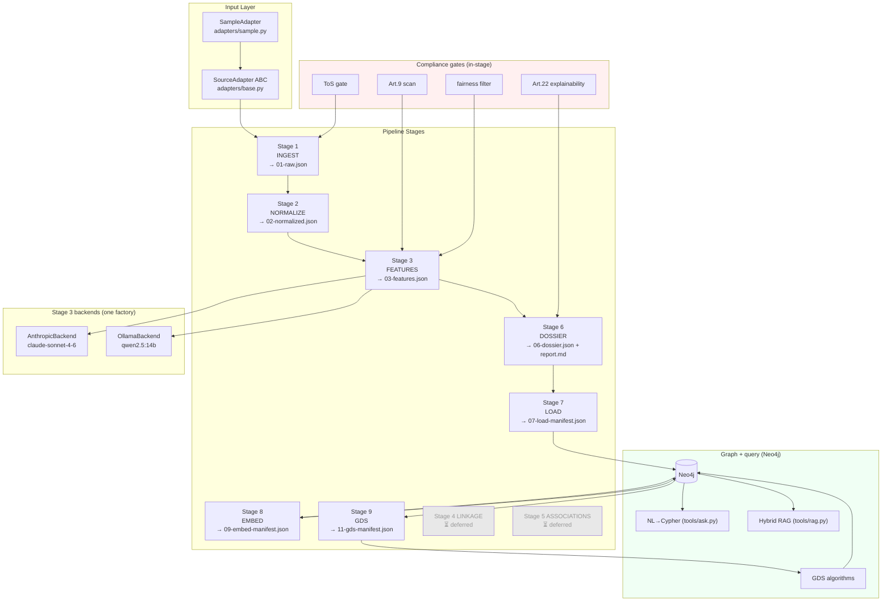
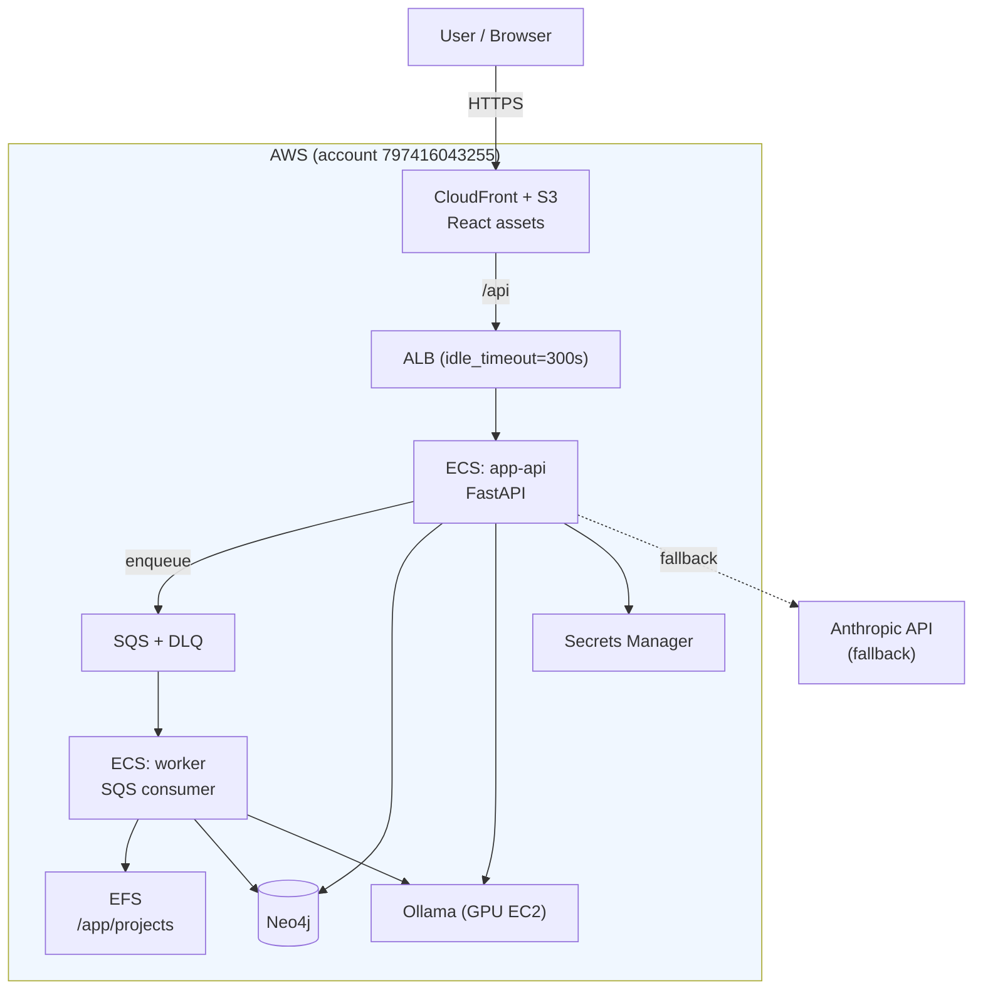
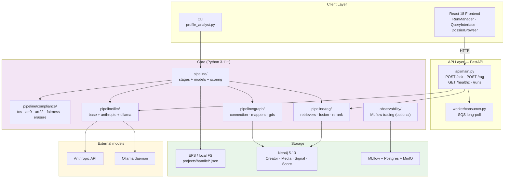
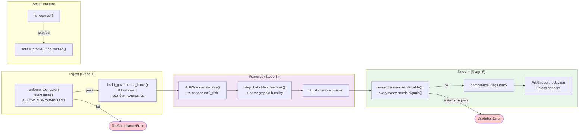
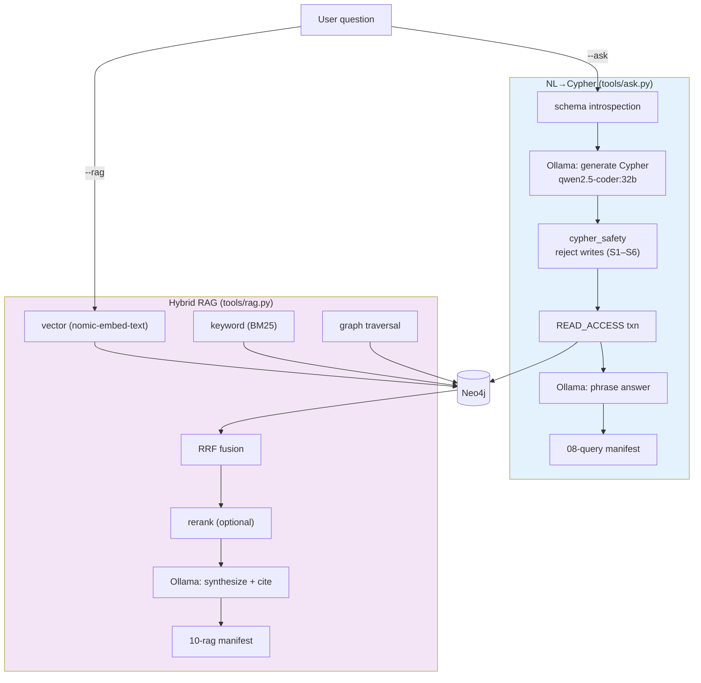

# Architecture

This document describes the high-level architecture of **profile-analyst**. If you want to
familiarize yourself with the code base, you are just in the right place!

Structured after [rust-analyzer's architecture doc](https://github.com/rust-lang/rust-analyzer/blob/master/docs/dev/architecture.md):
a Bird's Eye View, then a Code Map that walks the tree directory by directory, then Cross-Cutting
Concerns. **Pay attention to the _Architecture Invariant_ sections** — they describe properties the
code relies on everywhere, and breaking one is how subtle bugs and compliance violations get in.

The source of truth for *behavior* is `specs/0001-social-media-associations-profile/spec.md` (plus
the later numbered specs). This file describes *where things live and why*. For a forward-looking
"run with zero external models" plan, see [`architecture-improvements.md`](./architecture-improvements.md).

## Bird's Eye View

On the highest level, profile-analyst is a thing which accepts **one Instagram handle** and produces
a **unified creator dossier** — a single JSON document (plus a Markdown report) covering the
creator's niche/attributes, brand affinity, engagement quality, sponsored-post detection, and
(in later versions) cross-platform identity linkage and an audience-overlap graph. The primary use
case is influencer-marketing analytics, and the whole thing is built compliance-first because the
inputs are data about real people.

The system has a clear **ground state** and **derived state**. The ground state is what a
`SourceAdapter` hands over — for the v1 default that is `projects/<handle>/00-input/sample.json`,
plus the governance posture declared on the adapter. Everything else is derived: the numbered
artifacts `01-raw.json … 11-gds-manifest.json` under `projects/<handle>/`, the Neo4j graph, and the
query manifests. Derived state is produced by a **staged pipeline**, where each stage is a pure
function from earlier artifacts to one new artifact.

The pipeline is deliberately *boring* in the load-bearing ways: stages are small, ordered, and
restartable; the interesting variation (which model, which backend, which retrieval mode) is pushed
behind narrow seams so the spine stays predictable.

**Architecture Invariant:** each stage is idempotent. A stage reads only earlier artifacts and
overwrites only its own — re-running Stage 3 cannot corrupt Stage 2's output or require Stage 6 to
re-run. This is what makes `--stage 3` (and crash-recovery) safe.

**Architecture Invariant:** every artifact is written atomically — serialized to a `.tmp` sibling
and then `os.replace`-d into place. A concurrent reader (the API, the frontend, a second stage)
never observes a half-written file.

**Architecture Invariant:** no artifact is written unless it validates against its
`schemas/NN-*.schema.json`. Validation runs in-process, before the write, on every run. The schema
files — not the Python types — are the contract between stages.

**Architecture Invariant:** the pipeline does no I/O except through a `SourceAdapter` (ingest), the
explicit artifact writes, and — only in Stage 3 and the query tools — a model call behind a single
factory. There is no hidden network access scattered through the stages.

## Code Map

This section talks briefly about various important directories and data structures. Pay attention to
the **Architecture Invariant** sections.

### `profile_analyst.py`

The CLI entry point and the only place the stage order is encoded (`STAGE_MAP`, `_parse_stages`).
Subcommands: the default run path (`--handle … --stage …`), plus `erase` / `gc` (GDPR Art. 17),
`load` (Stage 7), `gds` (Stage 9), and the query flags `--ask` / `--rag`. `worker/consumer.py`
re-enters the program through `main(argv)`, so the CLI *is* the batch API.

**Architecture Invariant:** `--stage all` expands to `1,2,3,6,7,8,9` — it pulls in the Neo4j/Ollama
stages. The model-free, service-free subset is the explicit `--stage 1,2,3,6`, which produces the
dossier with nothing but the filesystem. (The `--help` string still advertises the old `1,2,3,6`
range; treat the code as truth.)

### `adapters/`

The source-agnostic ingestion boundary. `base.py` defines the `SourceAdapter` ABC; `sample.py` is
the v1 default `SampleAdapter`, which reads a local JSON fixture and reaches no network.

A `SourceAdapter` is two methods (`fetch_profile`, `fetch_media`) plus a block of **governance
attributes** declared as class attributes: `data_category`, `tos_compliant`, `gdpr_basis`,
`requires_creator_consent`, `max_retention_days`, `deletion_on_request`, rate-limit fields, and the
`available_fields` / `estimated_fields` sets.

**Architecture Invariant:** a source declares its full governance posture *before any of its data
enters the pipeline*. The ToS gate reads these attributes at ingest, so an adapter that does not
declare a posture cannot be ingested — the legal metadata is structurally impossible to forget.

**API Boundary:** adapters are the only place that touches a third-party data source. Adding a live
source (Instagram Graph API, a consent-based provider, a scraper) means adding an adapter and its
governance attributes — nothing downstream needs to know.

### `pipeline/`

The core. `models.py` holds the canonical Pydantic v2 types (`Profile`, `MediaItem`,
`GovernanceBlock`, `Dossier`, `DossierScore`, `ComplianceFlags`, `Provenance`). `scoring_utils.py`
holds the deterministic scoring primitives (tier benchmarks, EQS/AUTH weights, `clamp`,
`follower_tier`, `er_vs_benchmark`) shared by Stage 3 and Stage 6. The stage modules are each a
single `run(handle, project_dir)`:

- `stage1_ingest.py` — ToS gate → adapter fetch → build governance block → validate → write `01-raw.json`.
- `stage2_normalize.py` — retention check → parse raw into the `Profile` model → validate → write `02-normalized.json`.
- `stage3_features.py` — compute deterministic features, call the LLM backend for the semantic slice, run the compliance scans, derive FTC status → write `03-features.json`.
- `stage6_dossier.py` — index features → compute composite scores → assemble `Dossier` + compliance flags → render `report.md` → write `06-dossier.json`.
- `stage7_load.py` / `stage8_embed.py` / `stage9_gds.py` — the Neo4j-backed stages (see `pipeline/graph/`).

Stages 4 (LINKAGE) and 5 (ASSOCIATIONS) are designed but not implemented; Stage 6 emits explicit
`{"status": "deferred"}` placeholders for them.

**Architecture Invariant:** Stage 3 produces features two ways — *deterministic* (12 features, with
`method` `computed`/`inferred`) and *model-derived* (`method = "llm"`) — but everything downstream
consumes features uniformly, keyed by `feature_id`. The deterministic features, the schema gate, the
Art. 9 scan, and the fairness filter run **identically regardless of which backend produced the LLM
slice**. The backend is a swappable detail, not a fork in the logic.

**Architecture Invariant:** rule-based sponsored-post detection (`_compute_sponsored_pass1`: the
`is_paid_partnership` flag, `#ad`/`#sponsored`/`#gifted` hashtags, caption patterns) is always
computed and is model-free. The model is asked only to find *undisclosed* commercial intent on top
of it.

### `pipeline/compliance/`

GDPR/FTC enforcement, exposed as a flat public API via `__init__.py`. Five modules: `tos.py`
(ToS-flag gate + governance builder), `art9.py` (special-category scanner), `art22.py`
(explainability + compliance-flag assembly + report redaction), `fairness.py` (forbidden-feature
blacklist + demographic-inference humility), `erasure.py` (Art. 17 erase + retention sweep).

**Architecture Invariant:** compliance is not a pipeline *stage* — it is a set of gates called from
*inside* the stages, so you cannot route around it by running stages directly. ToS at ingest;
`assert_within_retention` at the head of Stages 2, 3, and 6; the Art. 9 scan and fairness filter in
Stage 3; Art. 22 explainability + flag assembly in Stage 6.

**Architecture Invariant:** the Art. 9 scanner is defense-in-depth. `Art9Scanner.enforce` *re-asserts*
`art9_risk = True` on whatever Stage 3 emitted, by feature-id, niche-value, and text pattern,
regardless of the producer — so a backend (or a future contributor) that forgets the flag cannot
suppress a special-category inference. It runs in both Stage 3 and Stage 6.

**Architecture Invariant:** every dossier score carries a non-empty `signals[]` list. This is the
GDPR Art. 22 explainability requirement, and it is enforced twice: at the type level
(`DossierScore.signals` has `min_length=1`) and by `assert_scores_explainable` before the dossier is
written. A score with no explanation cannot exist.

### `pipeline/llm/`

The Stage 3 model boundary. `base.py` defines the `LLMBackend` ABC, the `get_llm_backend()` factory,
and the shared helpers (`load_feature_prompt`, `build_feature_payload`, `parse_structured_output`).
`anthropic_backend.py` calls the Claude API with prompt caching; `ollama_backend.py` calls a local
Ollama daemon and constrains the grammar to a JSON array; `ollama_client.py` is the HTTP wrapper;
`ollama_embed.py` produces embeddings for RAG.

**Architecture Invariant:** all model selection happens in exactly one place —
`get_llm_backend()`. Backends are imported lazily inside the factory, so `pipeline.llm` loads with
neither the `anthropic` SDK nor `httpx` installed. Adding a backend (e.g. a deterministic one) is a
new branch here and nothing else.

**Architecture Invariant:** a backend never silently repairs model output. Invalid JSON or a
schema-violating feature *raises*. Only an **unreachable** Ollama host (`OllamaError`) triggers the
Anthropic fallback, and only when `ASK_FALLBACK=true` — a wrong answer is never preferred to a loud
failure.

**Architecture Invariant:** model calls are deterministic where the provider allows it
(`temperature=0`, `seed=0`), and `data_egress` is recorded on every response (`local-only` vs
`anthropic-api`) so the dossier's provenance is honest about what left the host.

### `pipeline/graph/`

The Neo4j layer (spec 0002/0004). `connection.py` is the `GraphSession` context manager
(lazy-imports the driver; `read`/`write` managed transactions, `run` auto-commit for schema).
`mappers.py` turns artifacts into node/edge property dicts; `constraints.py` sets up labels and
indexes; `queries.py` holds hand-written audit Cypher; `gds.py`, `gds_algorithms.py`,
`gds_writeback.py` run and persist the graph-data-science results.

**Architecture Invariant:** the graph is *written* only by Stage 7. Embeddings (Stage 8), GDS
(Stage 9), and the query tools all *read* that graph. Creator identity is always `user_id`, and
traversal to media is always the `HAS_MEDIA` relationship (never `POSTED`).

**Architecture Invariant:** the GDS algorithms require Neo4j Enterprise GDS; they are a Stage-9
concern and are never on the dossier's critical path.

### `pipeline/rag/`

Hybrid retrieval (spec 0005). `retrievers.py` has three retrievers — `VectorRetriever`,
`KeywordRetriever`, `GraphRetriever` — all returning the same `{user_id, username, score, source}`
shape. `fusion.py` does Reciprocal Rank Fusion (per-mode weights, rollup media→creator,
truncate to top-K). `indexes.py` manages the vector + full-text indexes; `rerank.py` is the optional
cross-encoder.

**Architecture Invariant:** retrieval degrades gracefully. Each mode runs independently; a mode
failure is recorded into the manifest, not raised. Only *all modes empty* raises `RAGError`.

### `tools/`

Operator-facing tools that sit on top of the graph. `ask.py` is the NL→Cypher path; `rag.py` is the
hybrid-RAG orchestrator; `cypher_safety.py` is the safety gate; `audit.py` and `validate.py` are
helpers (`validate.py` backs `make validate`).

`cypher_safety.py` is pure and DB-free — *"the single point through which any model-generated Cypher
must pass before execution."* It strips string literals/comments before scanning, denies write/admin
keywords by whole token, uses a **positive** CALL allowlist, grounds every label/property against the
live schema, requires parameterization, and injects/clamps a `LIMIT`.

**Architecture Invariant:** a model-generated query is guarded twice, independently.
`validate_and_sanitize_cypher` enforces the static gates (S1, S2, S4, S5, S6) *and* the query runs
in a `READ_ACCESS` transaction (`ReadOnlyGraph`), so a write is rejected by the server even if the
static check is somehow bypassed.

**Architecture Invariant:** the query manifest is *always* written, including on rejection, and
creator data never leaves the host (`data_egress: local-only`). An auditor can reconstruct every
question asked and every query run.

### `observability/`

MLflow tracing + signal lineage (spec 0006): `tracing.py` (`init_tracing`, the `trace` decorator),
`spans.py` (span types), `lineage.py` (signal provenance), `evaluation.py` (RAG eval harness),
`config.py`.

**Architecture Invariant:** observability is strictly optional. Every tracing/lineage call is a
no-op when `OBSERVABILITY_ENABLED` is falsy, and `init_tracing` failures are swallowed at every entry
point. The pipeline produces byte-identical artifacts with MLflow absent.

### `schemas/`

The draft-7 JSON Schemas, one per artifact (`01-raw` … `11-gds`). These are the inter-stage contract
referenced by the invariant above. Note that `03-features` allows `method ∈
{computed, inferred, llm, deferred}` and leaves `value` untyped — a deterministic backend can emit
`method:"inferred"` features with no schema change.

### `prompts/`

`stage3-features.md` — the single system prompt for the Stage 3 model, sent verbatim to *both*
backends. The user payload is built by `build_feature_payload`, which is the data-minimization point:
only handle, bio, follower count, and per-media captions/hashtags/mentions/partnership flags are sent
— never engagement counts or governance metadata.

### `api/`

A thin, read-only FastAPI surface (spec 0007). `main.py` exposes `POST /ask`, `POST /rag`,
`GET /healthz`, and includes the `/runs` router (`runs.py`). `models.py` is the request/response
schema; `deps.py` holds the health checks and lifespan hooks.

**Architecture Invariant:** the API adds no analytics and no write path. `/ask` and `/rag` delegate
to the *same* `tools.ask.ask` / `tools.rag.run` the CLI uses (inheriting every safety gate), and
`/runs` only enqueues to SQS. `/healthz` returns 503 unless Neo4j and Ollama are reachable, so an
orchestrator never routes traffic to a half-up task.

### `worker/`

`consumer.py` — the SQS consumer for async batch runs (spec 0008). Long-polls `RUNS_QUEUE_URL`,
re-enters the pipeline through `profile_analyst.main(argv)`, and writes status markers
(`running`/`succeeded`/`failed`) to `projects/<handle>/runs/<run_id>.json` on EFS. After
`maxReceiveCount` (3) it abandons a poison message to the DLQ.

**Architecture Invariant:** the worker executes the pipeline by calling the CLI's `main`, not by
re-implementing stage orchestration. There is exactly one definition of "run the pipeline."

### `frontend/`

A React 18 + Vite + TailwindCSS dashboard (spec 0009): RunManager, QueryInterface, DossierBrowser,
backed by TanStack Query hooks over the API. It is a pure client of the read-only API and holds no
pipeline logic.

### `deploy/`

Infrastructure as code. `deploy/aws/terraform/` provisions the Fargate stack (ECS, ALB, CloudFront,
SQS, EFS, Secrets Manager); `deploy/docker/` plus the top-level `Dockerfile`, `compose.yaml`, and
`compose.gpu.yaml` provide the local/container runtime. The image entrypoint dispatches `api` | `cli`
| `worker` from one build.

### `specs/`

Spec-driven development lives here — `0001` (core pipeline) through `0011` (cross-platform linkage)
are accepted; `0011` realizes the deferred Stage 4 (UIL v3a) at the spec level but is **not yet
implemented** (Stage 6 still emits the deferred linkage placeholder); `0012` (associations) is
planned. Each spec is `spec.md` (the source of truth) + `metadata.yml` (decision register +
acceptance) + `plan.md`/`tasks.md`/`summary.md`.
**When code and this document disagree with a spec, the spec wins** — fix the code or the doc.

## Cross-Cutting Concerns

### Compliance

Compliance is the reason the architecture looks the way it does. It is woven through the stages
rather than bolted on: governance posture is declared on the adapter, a governance block rides inside
every artifact, retention is checked at the head of each derived stage, Art. 9 is scanned and
re-asserted, Art. 22 explainability is enforced on every score, FTC disclosure status is always
computed, and Art. 17 erasure (`erase`/`gc`) can delete a subject's entire footprint. The relevant
clauses live in `spec.md §9` and in `CLAUDE.md`.

### Idempotency and artifacts

The `projects/<handle>/` directory *is* the database for the single-profile path. Stages are pure
functions over these files; the numbered prefixes encode order; `.tmp` + `os.replace` makes each
write atomic. This is why the pipeline is restartable, why `--stage` can run any subset, and why the
API can read a dossier while a worker is recomputing features.

### The model boundary

There is exactly one place a model is consulted in the core pipeline — Stage 3, behind
`get_llm_backend()` — and one place in the query layer — `tools/ask.py` and `tools/rag.py`. Keeping
the boundary this narrow is what makes "swap the model" or "run with no external model at all" a
*local* change. See [`architecture-improvements.md`](./architecture-improvements.md).

### Determinism

The deterministic Stage 3 features, the scorers, and the schema gates are fully reproducible. Model
calls pin `temperature=0`/`seed=0` to be as reproducible as the provider allows. Reproducibility is a
prerequisite for the explainability story, not just a testing convenience.

### Testing

Tests live under `tests/`, mirroring the package layout (`tests/compliance`, `tests/graph`,
`tests/llm`, `tests/rag`, `tests/observability`, plus per-stage and end-to-end tests), with fixtures
under `tests/fixtures/`.

**Architecture Invariant:** the unit suite runs offline. The `SampleAdapter` reads a local fixture
(no network), LLM backends are swapped for fakes, and the Neo4j/Ollama-dependent suites are isolated
behind their own conftest. `make test` does not require an API key, a daemon, or a database.

### Error handling

Stages fail loudly: a missing upstream artifact is a `FileNotFoundError`, a schema violation is a
`jsonschema.ValidationError`, a compliance breach is a typed `ComplianceError`. The CLI maps
*operational* failures to exit code 2 (Stage 8/9 when Ollama/GDS is unavailable; `--ask` on a
rejected query or unreachable host) and validation failures to exit 1, so the SQS worker can tell
"retry me" from "this input is bad."

### Observability

When enabled, spans (`CHAIN`/`RETRIEVER`/`LLM`/`TOOL`) and signal lineage flow to MLflow (backed by
Postgres + MinIO in compose). It is observation only — never on the critical path, never able to
change an artifact, always a no-op when switched off.

### Deployment

One image, three roles (`api` | `cli` | `worker`), composed locally and run on AWS Fargate.

The dossier-only subset (`--stage 1,2,3,6`) needs none of this — it runs from the filesystem alone,
which is the property the improvement plan aims to make the default for the whole tool.

---

## Appendix — Diagrams & Reference Tables

The prose above is the contributor's map. This appendix keeps the wider-angle diagrams and the
quick-reference tables. All Mermaid here is validated.

### A.1 System architecture (logical)

### A.2 Compliance gates (GDPR + FTC)

### A.3 Query layer — NL→Cypher and Hybrid RAG

### A.4 Pipeline stages

| Stage | Name | Status | Input | Output |
|-------|------|--------|-------|--------|
| 1 | INGEST | live | adapter | `01-raw.json` |
| 2 | NORMALIZE | live | `01-raw.json` | `02-normalized.json` |
| 3 | FEATURES | live | `02-normalized.json` | `03-features.json` |
| 4 | LINKAGE | deferred | multi-profile | `04-linkage.json` |
| 5 | ASSOCIATIONS | deferred | multi-profile | `05-graph.json` |
| 6 | DOSSIER | live | `02`,`03` | `06-dossier.json` + `report.md` |
| 7 | LOAD | live | `02`,`03`,`06` | `07-load-manifest.json` (Neo4j) |
| 8 | EMBED | live | Neo4j | `09-embed-manifest.json` |
| 9 | GDS | live | Neo4j | `11-gds-manifest.json` |

Stage 6 emits four scores — `engagement_quality`, `authenticity`, `sponsorship_transparency`,
`brand_safety` (`pipeline/stage6_dossier.py:220-226`). `brand_affinity_signals` is computed in
Stage 3 but not yet surfaced in the dossier (see the improvement plan).

### A.5 Schemas (`schemas/`)

| File | Stage | Key fields |
|------|-------|-----------|
| `01-raw` | 1 | `handle`, `_governance` (8 fields), `raw_profile`, `raw_media[]` |
| `02-normalized` | 2 | canonical `Profile` + `governance` |
| `03-features` | 3 | `ftc_disclosure_status`, `features[{feature_id,value,confidence,method,art9_risk,signals}]` |
| `06-dossier` | 6 | `scores{}`, `linkage`, `associations`, `compliance_flags`, `provenance` |
| `07-graph-load` | 7 | `operation_id`, counts, `rows_merged/superseded` |
| `08-query` | ask | `cypher`, `params`, `validation`, `answer`, `data_egress` |
| `09-embed` | 8 | `model`, `dimensions`, `reembedded/skipped` counts |
| `10-rag` | rag | `modes_run[]`, `fused_candidates[]`, `citations[]` |
| `11-gds` | 9 | `algorithms_run[]`, `community_count`, `art9_warnings[]` |

`method` ∈ `{computed, inferred, llm, deferred}`; `value` is untyped.

### A.6 Specifications

| Spec | Title | Status |
|------|-------|--------|
| 0001 | Core pipeline | accepted |
| 0002 | Neo4j graph persistence | accepted |
| 0003 | Ollama LLM + NL→Cypher | accepted |
| 0004 | Neo4j GDS | accepted |
| 0005 | Hybrid RAG | accepted |
| 0006 | MLflow observability | accepted |
| 0007 | Docker deployment | accepted |
| 0008 | AWS Fargate deployment | accepted |
| 0009 | Frontend dashboard | accepted |
| 0010 | Local-LLM reliability | accepted |
| 0011 | Cross-platform linkage (Stage 4 v3a) | accepted (spec; impl pending) |
| 0012 | Audience-overlap graph | planned |

### A.7 API surface (`api/main.py`)

| Method | Path | Delegates to |
|--------|------|--------------|
| POST | `/ask` | `tools.ask.ask` (NL→Cypher) |
| POST | `/rag` | `tools.rag.run` (hybrid RAG) |
| GET | `/healthz` | Neo4j + Ollama readiness (503 if down) |
| POST/GET | `/runs`, `/runs/{id}` | SQS enqueue + status markers |

### A.8 Key environment variables

| Variable | Default | Purpose |
|----------|---------|---------|
| `LLM_BACKEND` | `anthropic` | Stage 3 backend (`anthropic`\|`ollama`) |
| `ANTHROPIC_API_KEY` | — | required when backend is anthropic |
| `ALLOW_NONCOMPLIANT` | `false` | bypass ToS gate (test only) |
| `OLLAMA_HOST` / `OLLAMA_*_MODEL` | localhost:11434 | local model serving |
| `OLLAMA_TIMEOUT_S` | `120` | raise to 600 on slow CPU hosts (spec 0010) |
| `ASK_FALLBACK` | `true` | fall back to Anthropic if Ollama unreachable |
| `NEO4J_URI/USER/PASSWORD` | bolt://localhost:7687 | graph connection |
| `RAG_MODES` / `RAG_*_K` / `RAG_RRF_K` | vector,graph,keyword / 50 / 60 | retrieval tuning |
| `OBSERVABILITY_ENABLED` | `false` | MLflow tracing on/off |
| `RUNS_QUEUE_URL` / `PROJECTS_DIR` | — | worker (SQS + EFS) |
