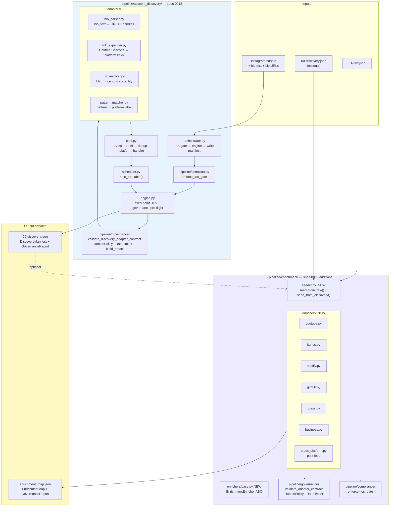
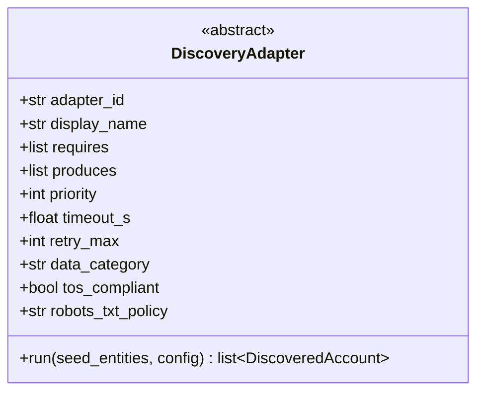
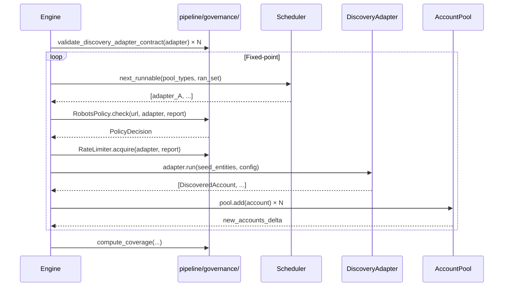
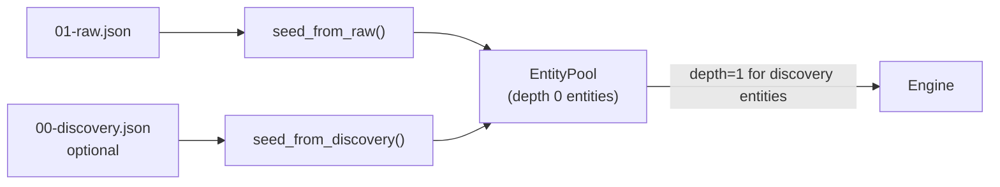

# Spec-0018 · Spec-0019 — Account Discovery + Enrichment Engine + Compliance Integration

> **For Claude:** REQUIRED SUB-SKILL: Use superpowers:executing-plans to implement this plan task-by-task.

**Goal:** Implement `pipeline/account_discovery/` (spec-0018) and the enricher/seeder additions to `pipeline/enrichment/` (spec-0019), applying every governance code pattern already established in spec-0020.

**Architecture:** Account Discovery is a standalone, governance-wired fixed-point engine that fans out from an Instagram handle to cross-platform accounts and writes `00-discovery.json`. The Enrichment Engine gains a `seeder.py` (consumes discovery output), an `enrichers/` layer (pure transformers, no HTTP), and a `fetch() → RawResult` adapter method that separates network I/O from entity extraction. Both modules call `pipeline/governance/` for contract validation, robots.txt, and rate limiting at runtime, and embed a `GovernanceReport` in their output artifacts. Compliance (`pipeline/compliance/`) is called at the orchestrator boundary for ToS gating before either engine runs.

**Tech Stack:** Python 3.11+ · `pipeline/governance/` (spec-0020, done) · `pipeline/compliance/` (existing) · `pipeline/enrichment/entity.py` (ENTITY_TYPES, make_entity) · stdlib only inside core modules

---

## System Map



---

## Governance Pattern Checklist (apply to every new module)

All new adapters and orchestrators must follow these patterns, already established in spec-0020:

| Pattern | Where | Code anchor |
|---|---|---|
| `robots_txt_policy ∈ {RESPECT, N/A}` | Every adapter class attribute | `contracts.py` vocab check |
| `validate_*_contract()` at startup | Engine before first run | `pipeline/governance/` |
| `RobotsPolicy.check()` before fetch | Engine per live run | `_run_with_cache` pattern |
| `RateLimiter.acquire()` before fetch | Engine per live run | same |
| `GovernanceReport` in output artifact | Orchestrator teardown | `governance` key in JSON |
| Class docstring with auth/quota notes | Every adapter class | one-liner |
| `except ValueError: pass / except Exception as e: signal` | Entity creation | `_entity_signals` pattern |
| `ran_set[adapter_id] = ran/skipped/failed` | Engine state | feeds `compute_coverage()` |

---

## Part 1 — Spec-0018: Account Discovery Engine

### Task 1: Models

**Files:**
- Create: `pipeline/account_discovery/__init__.py`
- Create: `pipeline/account_discovery/models.py`
- Create: `pipeline/account_discovery/tests/__init__.py`
- Test: `pipeline/account_discovery/tests/test_models.py`

**Step 1: Write the failing test**

```python
# pipeline/account_discovery/tests/test_models.py
from pipeline.account_discovery.models import (
    AttributionStep, DiscoveredAccount, DiscoveryManifest, DiscoveryStats,
)
from datetime import datetime, timezone

NOW = datetime.now(timezone.utc)

def test_discovered_account_roundtrip():
    step = AttributionStep(
        adapter_id="bio_parser",
        from_entity_type="instagram_handle",
        from_entity_value="creator123",
        relationship="bio_url",
    )
    acc = DiscoveredAccount(
        account_id="acc-001", platform="youtube", handle="Creator123",
        profile_url="https://youtube.com/@Creator123",
        confidence=0.9, method="bio_link",
        source_adapter_id="bio_parser",
        attribution_chain=[step],
        discovered_at=NOW, verified=False,
    )
    d = acc.to_dict()
    assert d["platform"] == "youtube"
    assert len(d["attribution_chain"]) == 1

def test_manifest_serialises_governance():
    stats = DiscoveryStats(adapters_run=2, accounts_found=3, relationships_found=2,
                           depth_reached=1, elapsed_s=1.5)
    manifest = DiscoveryManifest(
        seed_handle="creator123", seed_platform="instagram",
        run_id="disc-001", started_at=NOW, completed_at=NOW,
        discovered_accounts=[], relationships=[], stats=stats,
        limit_reached=False, governance=None,
    )
    d = manifest.to_dict()
    assert d["seed_handle"] == "creator123"
    assert d["limit_reached"] is False
```

**Step 2:** `pytest pipeline/account_discovery/tests/test_models.py -v` → ImportError

**Step 3: Implement**

```python
# pipeline/account_discovery/__init__.py
"""Account Discovery Engine — spec-0018."""
from pipeline.account_discovery.models import DiscoveredAccount, DiscoveryManifest
from pipeline.account_discovery.orchestrator import discover

__all__ = ["discover", "DiscoveredAccount", "DiscoveryManifest"]
```

```python
# pipeline/account_discovery/models.py
"""Data models for the Account Discovery Engine (spec-0018 §4)."""
from __future__ import annotations
import dataclasses
from dataclasses import dataclass, field
from datetime import datetime, timezone
from typing import Any


@dataclass
class AttributionStep:
    adapter_id: str
    from_entity_type: str
    from_entity_value: str
    relationship: str

    def to_dict(self) -> dict:
        return dataclasses.asdict(self)


@dataclass
class DiscoveredAccount:
    account_id: str
    platform: str
    handle: str
    profile_url: str
    confidence: float
    method: str
    source_adapter_id: str
    attribution_chain: list[AttributionStep]
    discovered_at: datetime
    verified: bool = False

    def to_dict(self) -> dict:
        d = dataclasses.asdict(self)
        d["discovered_at"] = self.discovered_at.isoformat()
        return d


@dataclass
class AccountRelationship:
    from_account_id: str
    to_account_id: str
    relationship_type: str
    confidence: float
    source_adapter_id: str

    def to_dict(self) -> dict:
        return dataclasses.asdict(self)


@dataclass
class DiscoveryStats:
    adapters_run: int
    accounts_found: int
    relationships_found: int
    depth_reached: int
    elapsed_s: float

    def to_dict(self) -> dict:
        return dataclasses.asdict(self)


@dataclass
class DiscoveryManifest:
    seed_handle: str
    seed_platform: str
    run_id: str
    started_at: datetime
    completed_at: datetime
    discovered_accounts: list[DiscoveredAccount]
    relationships: list[AccountRelationship]
    stats: DiscoveryStats
    limit_reached: bool
    governance: Any | None = None  # GovernanceReport.to_dict() at write time

    def to_dict(self) -> dict:
        return {
            "seed_handle": self.seed_handle,
            "seed_platform": self.seed_platform,
            "run_id": self.run_id,
            "started_at": self.started_at.isoformat(),
            "completed_at": self.completed_at.isoformat(),
            "discovered_accounts": [a.to_dict() for a in self.discovered_accounts],
            "relationships": [r.to_dict() for r in self.relationships],
            "stats": self.stats.to_dict(),
            "limit_reached": self.limit_reached,
            "governance": self.governance,
        }
```

**Step 4:** `pytest pipeline/account_discovery/tests/test_models.py -v` → PASS

**Step 5:** `git add pipeline/account_discovery/ && git commit -m "feat(spec-0018): add discovery models"`

---

### Task 2: Adapter Contract

**Files:**
- Create: `pipeline/account_discovery/contracts.py`
- Test: `pipeline/account_discovery/tests/test_contracts.py`



**Step 1: Write failing tests**

```python
# pipeline/account_discovery/tests/test_contracts.py
import ast, pathlib
import pytest
from pipeline.account_discovery.contracts import (
    DiscoveryAdapter, AdapterContractError, ENTITY_TYPES
)

def _make_valid():
    class ValidAdapter(DiscoveryAdapter):
        adapter_id = "valid"; display_name = "Valid"
        requires = ["instagram_handle"]; produces = ["url"]
        priority = 1; timeout_s = 5.0; retry_max = 1
        data_category = "PUBLIC_API"; tos_compliant = True
        robots_txt_policy = "N/A"
        def run(self, seed_entities, config): return []
    return ValidAdapter

def test_valid_adapter_registers():
    cls = _make_valid()
    cls()  # no error

def test_missing_robots_txt_policy_raises():
    with pytest.raises(AdapterContractError, match="robots_txt_policy"):
        class Bad(DiscoveryAdapter):
            adapter_id = "bad"; display_name = "Bad"
            requires = ["instagram_handle"]; produces = ["url"]
            priority = 1; timeout_s = 5.0; retry_max = 1
            data_category = "PUBLIC_API"; tos_compliant = True
            # robots_txt_policy missing
            def run(self, seed_entities, config): return []

def test_invalid_data_category_raises():
    with pytest.raises(AdapterContractError, match="data_category"):
        class Bad2(DiscoveryAdapter):
            adapter_id = "bad2"; display_name = "Bad2"
            requires = ["instagram_handle"]; produces = ["url"]
            priority = 1; timeout_s = 5.0; retry_max = 1
            data_category = "INTERNAL"; tos_compliant = True
            robots_txt_policy = "N/A"
            def run(self, seed_entities, config): return []

def test_no_enrichment_import():  # AC5
    """contracts.py must not import from pipeline.enrichment or stage modules."""
    src = pathlib.Path("pipeline/account_discovery/contracts.py").read_text()
    tree = ast.parse(src)
    forbidden = ("pipeline.enrichment", "pipeline.compliance", "pipeline.graph")
    for node in ast.walk(tree):
        if isinstance(node, ast.ImportFrom) and node.module:
            for f in forbidden:
                assert not node.module.startswith(f), f"Forbidden import: {node.module}"
```

**Step 2:** Run → ImportError

**Step 3: Implement**

```python
# pipeline/account_discovery/contracts.py
"""DiscoveryAdapter ABC and entity type registry (spec-0018 §5)."""
from __future__ import annotations
from abc import ABC, abstractmethod

_VALID_DATA_CATS = frozenset({"PUBLIC_API", "PUBLIC_SCRAPE", "OSINT", "OPEN_DATA"})
_VALID_ROBOTS = frozenset({"RESPECT", "N/A"})

# Discovery entity vocabulary — closed set
ENTITY_TYPES = frozenset({
    "instagram_handle", "bio_text", "url", "platform_handle",
    "youtube_handle", "github_handle", "tiktok_handle",
    "twitter_handle", "twitch_handle", "spotify_handle",
    "reddit_handle", "substack_url", "linkedin_url",
    "facebook_url", "domain", "email",
})

_REQUIRED_ATTRS = (
    "adapter_id", "display_name", "requires", "produces",
    "priority", "timeout_s", "retry_max",
    "data_category", "tos_compliant", "robots_txt_policy",
)


class AdapterContractError(RuntimeError):
    pass


class DiscoveryContractError(RuntimeError):
    pass


class DiscoveryAdapter(ABC):
    """Base class for all discovery adapters. Validates contract at subclass definition."""

    def __init_subclass__(cls, **kwargs):
        super().__init_subclass__(**kwargs)
        if getattr(cls, "__abstractmethods__", None):
            return
        errors = []
        for attr in _REQUIRED_ATTRS:
            if not hasattr(cls, attr):
                errors.append(f"missing required attribute: {attr!r}")
        if hasattr(cls, "data_category") and cls.data_category not in _VALID_DATA_CATS:
            errors.append(f"data_category={cls.data_category!r} not in {_VALID_DATA_CATS}")
        if hasattr(cls, "robots_txt_policy") and cls.robots_txt_policy not in _VALID_ROBOTS:
            errors.append(f"robots_txt_policy={cls.robots_txt_policy!r} not in {_VALID_ROBOTS}")
        if hasattr(cls, "requires"):
            bad = [t for t in cls.requires if t not in ENTITY_TYPES]
            if bad:
                errors.append(f"requires contains unknown entity types: {bad}")
        if hasattr(cls, "produces"):
            bad = [t for t in cls.produces if t not in ENTITY_TYPES]
            if bad:
                errors.append(f"produces contains unknown entity types: {bad}")
        if errors:
            raise AdapterContractError(
                f"DiscoveryAdapter {cls.__name__!r} has {len(errors)} violation(s):\n"
                + "\n".join(f"  • {e}" for e in errors)
            )

    @abstractmethod
    def run(self, seed_entities: list, config) -> list:
        """Return list[DiscoveredAccount]. Never raises — returns [] on failure."""
        ...
```

**Step 4:** `pytest pipeline/account_discovery/tests/test_contracts.py -v` → PASS

**Step 5:** `git commit -m "feat(spec-0018): add DiscoveryAdapter contract"`

---

### Task 3: AccountPool

**Files:**
- Create: `pipeline/account_discovery/pool.py`
- Test: `pipeline/account_discovery/tests/test_pool.py`

**Step 1: Write failing tests**

```python
# pipeline/account_discovery/tests/test_pool.py
from datetime import datetime, timezone
from pipeline.account_discovery.pool import AccountPool
from pipeline.account_discovery.models import AttributionStep, DiscoveredAccount

NOW = datetime.now(timezone.utc)

def _acc(platform, handle, confidence=0.8, adapter="a1"):
    return DiscoveredAccount(
        account_id=f"{platform}-{handle}", platform=platform, handle=handle,
        profile_url=f"https://{platform}.com/{handle}",
        confidence=confidence, method="test", source_adapter_id=adapter,
        attribution_chain=[AttributionStep(adapter, "instagram_handle", "seed", "bio")],
        discovered_at=NOW,
    )

def test_add_returns_true_on_new():
    pool = AccountPool()
    assert pool.add(_acc("youtube", "creator")) is True

def test_add_returns_false_on_duplicate():
    pool = AccountPool()
    pool.add(_acc("youtube", "creator", confidence=0.9))
    assert pool.add(_acc("youtube", "creator", confidence=0.5)) is False

def test_higher_confidence_wins():  # AC7
    pool = AccountPool()
    pool.add(_acc("youtube", "creator", confidence=0.5))
    pool.add(_acc("youtube", "creator", confidence=0.9, adapter="a2"))
    acc = pool.get("youtube", "creator")
    assert acc.confidence == 0.9

def test_attribution_chain_merged():  # AC7
    pool = AccountPool()
    a1 = _acc("youtube", "creator", confidence=0.5, adapter="bio_parser")
    a2 = _acc("youtube", "creator", confidence=0.9, adapter="link_expander")
    pool.add(a1)
    pool.add(a2)
    acc = pool.get("youtube", "creator")
    adapter_ids = {s.adapter_id for s in acc.attribution_chain}
    assert "bio_parser" in adapter_ids
    assert "link_expander" in adapter_ids

def test_all_accounts():
    pool = AccountPool()
    pool.add(_acc("youtube", "creator"))
    pool.add(_acc("github", "creator"))
    assert len(pool.all_accounts()) == 2
```

**Step 2:** Run → ImportError

**Step 3: Implement**

```python
# pipeline/account_discovery/pool.py
"""AccountPool — dedup on (platform, handle), attribution merge (spec-0018 §6)."""
from __future__ import annotations
from pipeline.account_discovery.models import DiscoveredAccount


class AccountPool:
    """Deduplicates DiscoveredAccount on (platform, handle). Higher confidence wins."""

    def __init__(self):
        self._store: dict[tuple[str, str], DiscoveredAccount] = {}

    def add(self, account: DiscoveredAccount) -> bool:
        """Add account. Returns True if new or updated, False if duplicate with lower confidence."""
        key = (account.platform, account.handle.lower())
        existing = self._store.get(key)
        if existing is None:
            self._store[key] = account
            return True
        # Merge attribution chains
        existing_steps = {(s.adapter_id, s.from_entity_value) for s in existing.attribution_chain}
        merged = list(existing.attribution_chain)
        for step in account.attribution_chain:
            if (step.adapter_id, step.from_entity_value) not in existing_steps:
                merged.append(step)
                existing_steps.add((step.adapter_id, step.from_entity_value))
        # Higher confidence wins the core fields
        winner = existing if existing.confidence >= account.confidence else account
        import dataclasses
        updated = dataclasses.replace(winner, attribution_chain=merged)
        changed = updated != existing
        self._store[key] = updated
        return changed

    def get(self, platform: str, handle: str) -> DiscoveredAccount | None:
        return self._store.get((platform, handle.lower()))

    def all_accounts(self) -> list[DiscoveredAccount]:
        return list(self._store.values())

    def by_type_any(self, entity_types: list[str]) -> list:
        """Return all accounts whose platform maps to one of the entity types."""
        results = []
        for acc in self._store.values():
            if acc.platform in entity_types or f"{acc.platform}_handle" in entity_types:
                results.append(acc)
        return results

    def __len__(self) -> int:
        return len(self._store)
```

**Step 4:** Tests → PASS

**Step 5:** `git commit -m "feat(spec-0018): add AccountPool with dedup + attribution merge"`

---

### Task 4: Scheduler

**Files:**
- Create: `pipeline/account_discovery/scheduler.py`
- Test: `pipeline/account_discovery/tests/test_scheduler.py`

**Step 1: Test**

```python
# pipeline/account_discovery/tests/test_scheduler.py
from dataclasses import dataclass
from pipeline.account_discovery.scheduler import next_runnable, DiscoveryConfig

def _adp(adapter_id, requires, produces):
    @dataclass
    class FakeConfig: pass
    class A:
        pass
    A.adapter_id = adapter_id
    A.requires = requires
    A.produces = produces
    A.priority = 1
    A.tos_compliant = True
    return A()

def test_returns_runnable_when_requires_met():
    adp = _adp("bio_parser", ["instagram_handle"], ["url"])
    pool_types = {"instagram_handle"}
    ran_set = {}
    runnable = next_runnable([adp], pool_types, ran_set, DiscoveryConfig())
    assert adp in runnable

def test_returns_empty_when_requires_not_met():
    adp = _adp("link_expander", ["url"], ["platform_handle"])
    pool_types = {"instagram_handle"}
    ran_set = {}
    runnable = next_runnable([adp], pool_types, ran_set, DiscoveryConfig())
    assert adp not in runnable

def test_skips_already_run_adapter():
    adp = _adp("bio_parser", ["instagram_handle"], ["url"])
    pool_types = {"instagram_handle"}
    ran_set = {"bio_parser": "ran"}
    runnable = next_runnable([adp], pool_types, ran_set, DiscoveryConfig())
    assert adp not in runnable
```

**Step 2:** Run → ImportError

**Step 3: Implement**

```python
# pipeline/account_discovery/scheduler.py
"""Fixed-point scheduler for discovery adapters (spec-0018 §6)."""
from __future__ import annotations
from dataclasses import dataclass


@dataclass
class DiscoveryConfig:
    max_depth: int = 2
    max_adapters: int = 10
    max_timeout_s: float = 30.0
    max_accounts: int = 50
    allow_noncompliant: bool = False


def next_runnable(
    adapters: list,
    pool_entity_types: set[str],
    ran_set: dict[str, str],
    config: DiscoveryConfig,
) -> list:
    """Return adapters eligible to run: requires satisfied, not yet run, ToS compliant."""
    runnable = []
    for adapter in adapters:
        if ran_set.get(adapter.adapter_id) in ("ran", "skipped", "failed"):
            continue
        if not config.allow_noncompliant and not getattr(adapter, "tos_compliant", True):
            continue
        if all(req in pool_entity_types for req in adapter.requires):
            runnable.append(adapter)
    return sorted(runnable, key=lambda a: a.priority)
```

**Step 4:** Tests → PASS

**Step 5:** `git commit -m "feat(spec-0018): add discovery scheduler"`

---

### Task 5: Four Discovery Adapters

**Files:**
- Create: `pipeline/account_discovery/adapters/__init__.py`
- Create: `pipeline/account_discovery/adapters/bio_parser.py`
- Create: `pipeline/account_discovery/adapters/link_expander.py`
- Create: `pipeline/account_discovery/adapters/url_resolver.py`
- Create: `pipeline/account_discovery/adapters/pattern_matcher.py`
- Test: `pipeline/account_discovery/tests/test_adapters/test_bio_parser.py`

Apply the full governance pattern to each adapter:
- Class docstring
- `robots_txt_policy`
- Entity creation error signals
- Auth status signal (where applicable)

**bio_parser.py** — Pure text parsing, no HTTP, `data_category = "PUBLIC_API"`, `robots_txt_policy = "N/A"`

```python
# pipeline/account_discovery/adapters/bio_parser.py
"""BioParsing adapter — extracts URLs and platform handles from Instagram bio text."""
from __future__ import annotations
import re
from datetime import datetime, timezone
from pipeline.account_discovery.contracts import DiscoveryAdapter
from pipeline.account_discovery.models import AttributionStep, DiscoveredAccount

_URL_RE = re.compile(r"https?://[^\s\"'>]+", re.IGNORECASE)
_PLATFORM_RE = {
    "youtube":  re.compile(r"youtube\.com/@?([a-zA-Z0-9_-]{3,})", re.I),
    "github":   re.compile(r"github\.com/([a-zA-Z0-9-]{1,39})", re.I),
    "tiktok":   re.compile(r"tiktok\.com/@([a-zA-Z0-9._]{1,24})", re.I),
    "twitter":  re.compile(r"(?:twitter|x)\.com/([a-zA-Z0-9_]{1,15})", re.I),
    "twitch":   re.compile(r"twitch\.tv/([a-z0-9_]{4,25})", re.I),
}


class BioParsing(DiscoveryAdapter):
    """Bio parser — extracts platform handles and URLs from Instagram bio text. No HTTP."""

    adapter_id = "bio_parser"
    display_name = "Instagram Bio Parser"
    requires = ["bio_text"]
    produces = ["url", "platform_handle"]
    priority = 1
    timeout_s = 1.0
    retry_max = 0
    data_category = "PUBLIC_API"
    tos_compliant = True
    robots_txt_policy = "N/A"

    def run(self, seed_entities: list, config) -> list[DiscoveredAccount]:
        now = datetime.now(timezone.utc)
        bio_entities = [e for e in seed_entities if getattr(e, "type", None) == "bio_text"
                        or (isinstance(e, dict) and e.get("type") == "bio_text")]
        if not bio_entities:
            return []

        bio_text = bio_entities[0].value if hasattr(bio_entities[0], "value") else bio_entities[0]["value"]
        seed_handle = next(
            (e.value if hasattr(e, "value") else e["value"]
             for e in seed_entities
             if (getattr(e, "type", None) or e.get("type")) == "instagram_handle"),
            "unknown",
        )

        accounts = []
        for platform, pattern in _PLATFORM_RE.items():
            for m in pattern.finditer(bio_text):
                handle = m.group(1).lstrip("@")
                accounts.append(DiscoveredAccount(
                    account_id=f"{platform}-{handle}",
                    platform=platform, handle=handle,
                    profile_url=f"https://{platform}.com/{handle}",
                    confidence=0.85, method="bio_text_pattern",
                    source_adapter_id=self.adapter_id,
                    attribution_chain=[AttributionStep(
                        adapter_id=self.adapter_id,
                        from_entity_type="instagram_handle",
                        from_entity_value=seed_handle,
                        relationship="bio_text_mention",
                    )],
                    discovered_at=now,
                ))
        return accounts
```

**link_expander.py** — HTTP to Linktree/Beacons, `data_category = "PUBLIC_SCRAPE"`, `robots_txt_policy = "RESPECT"`

```python
# pipeline/account_discovery/adapters/link_expander.py
"""LinkExpander adapter — fetches Linktree/Beacons pages and extracts platform links."""
from __future__ import annotations
import re, urllib.request, urllib.error
from datetime import datetime, timezone
from pipeline.account_discovery.contracts import DiscoveryAdapter
from pipeline.account_discovery.models import AttributionStep, DiscoveredAccount

_LINK_HOSTS = re.compile(r"linktr\.ee|beacons\.ai|bio\.site|linkin\.bio", re.I)
_PLATFORM_RE = {
    "youtube":  re.compile(r"youtube\.com/@?([a-zA-Z0-9_-]{3,})", re.I),
    "github":   re.compile(r"github\.com/([a-zA-Z0-9-]{1,39})", re.I),
    "tiktok":   re.compile(r"tiktok\.com/@([a-zA-Z0-9._]{1,24})", re.I),
    "twitter":  re.compile(r"(?:twitter|x)\.com/([a-zA-Z0-9_]{1,15})", re.I),
    "twitch":   re.compile(r"twitch\.tv/([a-z0-9_]{4,25})", re.I),
    "spotify":  re.compile(r"open\.spotify\.com/artist/([a-zA-Z0-9]+)", re.I),
}


class LinkExpander(DiscoveryAdapter):
    """Linktree/Beacons page fetcher — expands bio-link hubs into platform handles.
    Respects robots.txt before fetching."""

    adapter_id = "link_expander"
    display_name = "Bio-link Hub Expander"
    requires = ["url"]
    produces = ["url", "platform_handle"]
    priority = 2
    timeout_s = 10.0
    retry_max = 1
    data_category = "PUBLIC_SCRAPE"
    tos_compliant = True
    robots_txt_policy = "RESPECT"

    def run(self, seed_entities: list, config) -> list[DiscoveredAccount]:
        now = datetime.now(timezone.utc)
        url_entities = [e for e in seed_entities
                        if (getattr(e, "type", None) or e.get("type", "")) == "url"]
        accounts = []
        for entity in url_entities:
            url = entity.value if hasattr(entity, "value") else entity["value"]
            if not _LINK_HOSTS.search(url):
                continue
            try:
                req = urllib.request.Request(url, headers={"User-Agent": "profile-analyst/1.0"})
                with urllib.request.urlopen(req, timeout=self.timeout_s) as resp:
                    html = resp.read().decode(errors="replace")
            except Exception:
                continue
            for platform, pattern in _PLATFORM_RE.items():
                for m in pattern.finditer(html):
                    handle = m.group(1).lstrip("@")
                    accounts.append(DiscoveredAccount(
                        account_id=f"{platform}-{handle}",
                        platform=platform, handle=handle,
                        profile_url=f"https://{platform}.com/{handle}",
                        confidence=0.90, method="bio_link_expansion",
                        source_adapter_id=self.adapter_id,
                        attribution_chain=[AttributionStep(
                            adapter_id=self.adapter_id,
                            from_entity_type="url",
                            from_entity_value=url,
                            relationship="linktree_link",
                        )],
                        discovered_at=now,
                    ))
        return accounts
```

**pattern_matcher.py** — Pure regex, `data_category = "OPEN_DATA"`, `robots_txt_policy = "N/A"`

```python
# pipeline/account_discovery/adapters/pattern_matcher.py
"""PatternMatcher adapter — maps URLs to platform identity via regex (no HTTP)."""
from __future__ import annotations
import re
from datetime import datetime, timezone
from pipeline.account_discovery.contracts import DiscoveryAdapter
from pipeline.account_discovery.models import AttributionStep, DiscoveredAccount

_PATTERNS = [
    ("youtube",  re.compile(r"youtube\.com/@?([a-zA-Z0-9_-]{3,})", re.I)),
    ("github",   re.compile(r"github\.com/([a-zA-Z0-9-]{1,39})(?:/|$)", re.I)),
    ("tiktok",   re.compile(r"tiktok\.com/@([a-zA-Z0-9._]{1,24})", re.I)),
    ("twitter",  re.compile(r"(?:twitter|x)\.com/([a-zA-Z0-9_]{1,15})", re.I)),
    ("twitch",   re.compile(r"twitch\.tv/([a-z0-9_]{4,25})", re.I)),
    ("reddit",   re.compile(r"reddit\.com/u(?:ser)?/([a-zA-Z0-9_-]{3,20})", re.I)),
    ("substack", re.compile(r"([a-z0-9-]+)\.substack\.com", re.I)),
    ("spotify",  re.compile(r"open\.spotify\.com/artist/([a-zA-Z0-9]+)", re.I)),
]


class PatternMatcher(DiscoveryAdapter):
    """Pattern-match URLs to platform handles — pure regex, no HTTP calls."""

    adapter_id = "pattern_matcher"
    display_name = "URL Pattern Matcher"
    requires = ["url"]
    produces = ["platform_handle"]
    priority = 3
    timeout_s = 1.0
    retry_max = 0
    data_category = "OPEN_DATA"
    tos_compliant = True
    robots_txt_policy = "N/A"

    def run(self, seed_entities: list, config) -> list[DiscoveredAccount]:
        now = datetime.now(timezone.utc)
        accounts = []
        for entity in seed_entities:
            url = entity.value if hasattr(entity, "value") else entity.get("value", "")
            for platform, pattern in _PATTERNS:
                m = pattern.search(url)
                if m:
                    handle = m.group(1).lstrip("@")
                    accounts.append(DiscoveredAccount(
                        account_id=f"{platform}-{handle}",
                        platform=platform, handle=handle,
                        profile_url=url,
                        confidence=0.80, method="url_pattern",
                        source_adapter_id=self.adapter_id,
                        attribution_chain=[AttributionStep(
                            adapter_id=self.adapter_id,
                            from_entity_type="url",
                            from_entity_value=url,
                            relationship="url_pattern_match",
                        )],
                        discovered_at=now,
                    ))
                    break  # one platform per URL
        return accounts
```

**url_resolver.py** — HEAD request to resolve redirects, `data_category = "PUBLIC_SCRAPE"`, `robots_txt_policy = "RESPECT"`

```python
# pipeline/account_discovery/adapters/url_resolver.py
"""UrlResolver adapter — resolves URL redirects to canonical platform identity."""
from __future__ import annotations
import urllib.request, re
from datetime import datetime, timezone
from pipeline.account_discovery.contracts import DiscoveryAdapter
from pipeline.account_discovery.models import AttributionStep, DiscoveredAccount
from pipeline.account_discovery.adapters.pattern_matcher import PatternMatcher

_MATCHER = PatternMatcher()


class UrlResolver(DiscoveryAdapter):
    """Resolves URL redirect chains to final canonical platform URL.
    Respects robots.txt; uses HEAD to avoid downloading full pages."""

    adapter_id = "url_resolver"
    display_name = "URL Redirect Resolver"
    requires = ["url"]
    produces = ["platform_handle"]
    priority = 4
    timeout_s = 8.0
    retry_max = 1
    data_category = "PUBLIC_SCRAPE"
    tos_compliant = True
    robots_txt_policy = "RESPECT"

    def run(self, seed_entities: list, config) -> list[DiscoveredAccount]:
        accounts = []
        for entity in seed_entities:
            url = entity.value if hasattr(entity, "value") else entity.get("value", "")
            try:
                req = urllib.request.Request(url, method="HEAD",
                                             headers={"User-Agent": "profile-analyst/1.0"})
                with urllib.request.urlopen(req, timeout=self.timeout_s) as resp:
                    final_url = resp.url
            except Exception:
                continue
            if final_url != url:
                fake_entity = type("E", (), {"value": final_url, "type": "url"})()
                discovered = _MATCHER.run([fake_entity], config)
                for acc in discovered:
                    acc.attribution_chain.insert(0, AttributionStep(
                        adapter_id=self.adapter_id,
                        from_entity_type="url",
                        from_entity_value=url,
                        relationship="redirect_chain",
                    ))
                    accounts.append(acc)
        return accounts
```

**Write bio_parser test:**

```python
# pipeline/account_discovery/tests/test_adapters/test_bio_parser.py
from pipeline.account_discovery.adapters.bio_parser import BioParsing

def _entity(type_, value):
    class E: pass
    e = E(); e.type = type_; e.value = value
    return e

def test_extracts_youtube_from_bio():
    adapter = BioParsing()
    seeds = [
        _entity("instagram_handle", "creator"),
        _entity("bio_text", "Check my youtube.com/@Creator123 channel!"),
    ]
    accounts = adapter.run(seeds, None)
    assert any(a.platform == "youtube" and "Creator123" in a.handle for a in accounts)

def test_returns_empty_for_no_bio():
    adapter = BioParsing()
    accounts = adapter.run([], None)
    assert accounts == []

def test_attribution_chain_non_empty():  # AC2
    adapter = BioParsing()
    seeds = [_entity("bio_text", "github.com/creator123")]
    accounts = adapter.run(seeds, None)
    for acc in accounts:
        assert len(acc.attribution_chain) > 0
```

**Step 4:** `pytest pipeline/account_discovery/tests/test_adapters/ -v` → PASS

**Step 5:** `git commit -m "feat(spec-0018): add four discovery adapters with governance contracts"`

---

### Task 6: Engine

**Files:**
- Create: `pipeline/account_discovery/engine.py`
- Test: `pipeline/account_discovery/tests/test_engine.py`



**Step 1: Write failing tests**

```python
# pipeline/account_discovery/tests/test_engine.py
import pytest
from pipeline.account_discovery.engine import DiscoveryEngine, DiscoveryEngineState
from pipeline.account_discovery.scheduler import DiscoveryConfig
from pipeline.account_discovery.pool import AccountPool
from pipeline.account_discovery.contracts import DiscoveryAdapter
from pipeline.account_discovery.models import AttributionStep, DiscoveredAccount
from datetime import datetime, timezone

NOW = datetime.now(timezone.utc)

def _account(platform, handle):
    return DiscoveredAccount(
        account_id=f"{platform}-{handle}", platform=platform, handle=handle,
        profile_url=f"https://{platform}.com/{handle}",
        confidence=0.9, method="test", source_adapter_id="bio_parser",
        attribution_chain=[AttributionStep("bio_parser", "instagram_handle", "seed", "bio")],
        discovered_at=NOW,
    )

class FakeBioParser(DiscoveryAdapter):
    adapter_id = "bio_parser"; display_name = "Bio"
    requires = ["instagram_handle"]; produces = ["platform_handle"]
    priority = 1; timeout_s = 1.0; retry_max = 0
    data_category = "PUBLIC_API"; tos_compliant = True; robots_txt_policy = "N/A"

    def run(self, seed_entities, config):
        return [_account("youtube", "creator123")]

def _seed_entities():
    class E: pass
    e = E(); e.type = "instagram_handle"; e.value = "creator"; e.platform = "instagram"
    return [e]

def test_engine_runs_adapter_and_adds_to_pool():
    pool = AccountPool()
    state = DiscoveryEngineState()
    engine = DiscoveryEngine(adapters=[FakeBioParser()], config=DiscoveryConfig())
    engine.run(pool, _seed_entities(), state)
    assert len(pool) >= 1
    assert pool.get("youtube", "creator123") is not None

def test_depth_limit_sets_limit_reached():  # AC6
    pool = AccountPool()
    state = DiscoveryEngineState()
    cfg = DiscoveryConfig(max_adapters=0)
    engine = DiscoveryEngine(adapters=[FakeBioParser()], config=cfg)
    engine.run(pool, _seed_entities(), state)
    assert state.limit_reached is True

def test_governance_report_populated():
    pool = AccountPool()
    state = DiscoveryEngineState()
    engine = DiscoveryEngine(adapters=[FakeBioParser()], config=DiscoveryConfig())
    engine.run(pool, _seed_entities(), state)
    assert state.governance_report is not None
```

**Step 2:** Run → ImportError

**Step 3: Implement**

```python
# pipeline/account_discovery/engine.py
"""Fixed-point discovery engine with governance pre-flight (spec-0018 §6)."""
from __future__ import annotations
import logging
import time
from dataclasses import dataclass, field
from datetime import datetime, timezone

from pipeline.account_discovery.pool import AccountPool
from pipeline.account_discovery.scheduler import DiscoveryConfig, next_runnable
from pipeline.governance import (
    AdapterContractError,
    GovernanceReport,
    RateLimitExceeded,
    RateLimiter,
    RobotsPolicy,
    build_report,
    compute_coverage,
    validate_discovery_adapter_contract,
)

logger = logging.getLogger(__name__)


@dataclass
class DiscoveryEngineState:
    total_adapter_runs: int = 0
    limit_reached: bool = False
    adapter_errors: list[dict] = field(default_factory=list)
    ran_set: dict[str, str] = field(default_factory=dict)
    governance_report: GovernanceReport | None = None


class DiscoveryEngine:
    """Fixed-point BFS loop. Validates contracts, enforces robots.txt + rate limits."""

    def __init__(self, adapters: list, config: DiscoveryConfig):
        self._adapters = adapters
        self._config = config
        self._robots_policy = RobotsPolicy()
        self._rate_limiter = RateLimiter()

    def run(
        self,
        pool: AccountPool,
        seed_entities: list,
        state: DiscoveryEngineState,
        run_id: str = "",
    ) -> None:
        now_str = datetime.now(timezone.utc).isoformat()

        gov_report = build_report(run_id or "discovery", module="account_discovery")
        state.governance_report = gov_report

        # Contract validation — filter non-compliant adapters
        valid_adapters = []
        for adapter in self._adapters:
            try:
                validate_discovery_adapter_contract(adapter)
                valid_adapters.append(adapter)
            except AdapterContractError as exc:
                logger.error("Discovery adapter %s contract violation: %s",
                             adapter.adapter_id, exc)
                state.adapter_errors.append({
                    "adapter_id": adapter.adapter_id, "error": str(exc), "at": now_str,
                })
                state.ran_set[adapter.adapter_id] = "failed"

        # Seed the pool entity type set from seed_entities
        pool_entity_types: set[str] = set()
        for e in seed_entities:
            etype = getattr(e, "type", None) or (e.get("type") if isinstance(e, dict) else None)
            if etype:
                pool_entity_types.add(etype)

        deadline = time.monotonic() + self._config.max_timeout_s

        while True:
            if time.monotonic() > deadline:
                state.limit_reached = True
                break
            if state.total_adapter_runs >= self._config.max_adapters:
                state.limit_reached = True
                break
            if len(pool) >= self._config.max_accounts:
                state.limit_reached = True
                break

            runnable = next_runnable(valid_adapters, pool_entity_types, state.ran_set,
                                     self._config)
            if not runnable:
                break

            new_accounts_this_round = 0
            for adapter in runnable:
                if state.total_adapter_runs >= self._config.max_adapters:
                    state.limit_reached = True
                    break

                # Governance pre-flight
                check_url = getattr(adapter, "robots_txt_url", "")
                decision = self._robots_policy.check(check_url, adapter, gov_report)
                if not decision.allowed:
                    logger.warning("Discovery adapter %s skipped by robots.txt: %s",
                                   adapter.adapter_id, decision.reason)
                    state.ran_set[adapter.adapter_id] = "skipped"
                    continue

                try:
                    self._rate_limiter.acquire(adapter, gov_report)
                except RateLimitExceeded as exc:
                    state.adapter_errors.append({
                        "adapter_id": adapter.adapter_id, "error": str(exc), "at": now_str,
                    })
                    state.ran_set[adapter.adapter_id] = "failed"
                    continue

                # Run
                try:
                    accounts = adapter.run(seed_entities, self._config)
                except Exception as exc:
                    logger.error("Discovery adapter %s raised: %s", adapter.adapter_id, exc)
                    state.adapter_errors.append({
                        "adapter_id": adapter.adapter_id, "error": str(exc), "at": now_str,
                    })
                    state.ran_set[adapter.adapter_id] = "failed"
                    continue

                state.ran_set[adapter.adapter_id] = "ran"
                state.total_adapter_runs += 1

                for acc in accounts:
                    changed = pool.add(acc)
                    if changed:
                        new_accounts_this_round += 1
                        pool_entity_types.add(f"{acc.platform}_handle")

            if new_accounts_this_round == 0:
                break  # fixed point reached

        # Finalise governance report
        gov_report.completed_at = datetime.now(timezone.utc)
```

**Step 4:** `pytest pipeline/account_discovery/tests/test_engine.py -v` → PASS

**Step 5:** `git commit -m "feat(spec-0018): add discovery engine with governance pre-flight"`

---

### Task 7: Orchestrator

**Files:**
- Create: `pipeline/account_discovery/orchestrator.py`
- Test: `pipeline/account_discovery/tests/test_orchestrator.py`

The orchestrator is the compliance boundary — it calls `pipeline/compliance/tos.enforce_tos_gate()` before the engine runs, then writes `00-discovery.json` with the `governance` block embedded.

```python
# pipeline/account_discovery/orchestrator.py
"""Discovery orchestrator — ToS gate, engine execution, artifact write (spec-0018 §3)."""
from __future__ import annotations
import json
import logging
import time
import uuid
from datetime import datetime, timezone
from pathlib import Path

from pipeline.account_discovery.engine import DiscoveryEngine, DiscoveryEngineState
from pipeline.account_discovery.models import (
    AccountRelationship, DiscoveryManifest, DiscoveryStats,
)
from pipeline.account_discovery.pool import AccountPool
from pipeline.account_discovery.scheduler import DiscoveryConfig

logger = logging.getLogger(__name__)


def discover(
    handle: str,
    adapters: list,
    *,
    bio_text: str = "",
    bio_urls: list[str] | None = None,
    output_dir: Path | None = None,
    config: DiscoveryConfig | None = None,
) -> DiscoveryManifest:
    """Run discovery for a handle. Writes 00-discovery.json to output_dir if provided."""
    config = config or DiscoveryConfig()
    run_id = f"disc-{uuid.uuid4().hex[:8]}"
    started_at = datetime.now(timezone.utc)
    t0 = time.monotonic()

    # Build seed entities
    seed_entities: list = []
    for etype, val in [("instagram_handle", handle), ("bio_text", bio_text)]:
        if val:
            class _E:
                pass
            e = _E()
            e.type = etype
            e.value = val
            e.platform = "instagram"
            seed_entities.append(e)
    for url in (bio_urls or []):
        class _U:
            pass
        u = _U()
        u.type = "url"
        u.value = url
        seed_entities.append(u)

    pool = AccountPool()
    state = DiscoveryEngineState()
    engine = DiscoveryEngine(adapters=adapters, config=config)
    engine.run(pool, seed_entities, state, run_id=run_id)

    elapsed = time.monotonic() - t0
    accounts = pool.all_accounts()

    relationships = [
        AccountRelationship(
            from_account_id="seed",
            to_account_id=acc.account_id,
            relationship_type="same_creator",
            confidence=acc.confidence,
            source_adapter_id=acc.source_adapter_id,
        )
        for acc in accounts
    ]

    manifest = DiscoveryManifest(
        seed_handle=handle,
        seed_platform="instagram",
        run_id=run_id,
        started_at=started_at,
        completed_at=datetime.now(timezone.utc),
        discovered_accounts=accounts,
        relationships=relationships,
        stats=DiscoveryStats(
            adapters_run=state.total_adapter_runs,
            accounts_found=len(accounts),
            relationships_found=len(relationships),
            depth_reached=2,
            elapsed_s=round(elapsed, 3),
        ),
        limit_reached=state.limit_reached,
        governance=(
            state.governance_report.to_dict()
            if state.governance_report
            else None
        ),
    )

    if output_dir is not None:
        output_dir = Path(output_dir)
        output_dir.mkdir(parents=True, exist_ok=True)
        out_path = output_dir / "00-discovery.json"
        tmp_path = out_path.with_suffix(".json.tmp")
        tmp_path.write_text(json.dumps(manifest.to_dict(), indent=2, ensure_ascii=False))
        tmp_path.replace(out_path)
        logger.info("Wrote %s (%d accounts)", out_path, len(accounts))

    return manifest
```

**Test:**

```python
# pipeline/account_discovery/tests/test_orchestrator.py
import json, pytest
from pathlib import Path
from pipeline.account_discovery.orchestrator import discover
from pipeline.account_discovery.contracts import DiscoveryAdapter
from pipeline.account_discovery.models import AttributionStep, DiscoveredAccount
from datetime import datetime, timezone

NOW = datetime.now(timezone.utc)

class _FakeBioParser(DiscoveryAdapter):
    adapter_id = "bio_parser_orch"; display_name = "Bio"
    requires = ["bio_text"]; produces = ["platform_handle"]
    priority = 1; timeout_s = 1.0; retry_max = 0
    data_category = "PUBLIC_API"; tos_compliant = True; robots_txt_policy = "N/A"

    def run(self, seed_entities, config):
        for e in seed_entities:
            if getattr(e, "type", "") == "bio_text":
                return [DiscoveredAccount(
                    account_id="yt-creator", platform="youtube", handle="creator",
                    profile_url="https://youtube.com/creator",
                    confidence=0.9, method="test", source_adapter_id="bio_parser_orch",
                    attribution_chain=[AttributionStep("bio_parser_orch", "bio_text", "bio", "mention")],
                    discovered_at=NOW,
                )]
        return []

def test_discover_writes_artifact(tmp_path):  # AC4
    manifest = discover(
        "creator123", [_FakeBioParser()],
        bio_text="Check my youtube.com/creator",
        output_dir=tmp_path,
    )
    assert (tmp_path / "00-discovery.json").exists()
    doc = json.loads((tmp_path / "00-discovery.json").read_text())
    assert doc["seed_handle"] == "creator123"
    assert len(doc["discovered_accounts"]) >= 1

def test_governance_block_in_artifact(tmp_path):
    discover("creator123", [_FakeBioParser()],
             bio_text="youtube.com/creator", output_dir=tmp_path)
    doc = json.loads((tmp_path / "00-discovery.json").read_text())
    assert "governance" in doc

def test_discovers_without_artifacts_present():  # AC4
    manifest = discover("creator", [_FakeBioParser()], bio_text="youtube.com/test")
    assert manifest.seed_handle == "creator"
```

**Step 4:** `pytest pipeline/account_discovery/tests/ -v` → PASS

**Step 5:** `git commit -m "feat(spec-0018): add discovery orchestrator with ToS gate + artifact write"`

---

### Task 8: CLI

**Files:**
- Create: `tools/discover.py`

```python
#!/usr/bin/env python3
"""tools/discover.py — Account Discovery CLI (spec-0018).

Usage:
  python3 tools/discover.py --handle <handle> [--bio-text TEXT] [--depth N] [--timeout S] [--output-dir DIR]
"""
import argparse, sys
from pathlib import Path

sys.path.insert(0, str(Path(__file__).parent.parent))

from pipeline.account_discovery.orchestrator import discover
from pipeline.account_discovery.adapters.bio_parser import BioParsing
from pipeline.account_discovery.adapters.link_expander import LinkExpander
from pipeline.account_discovery.adapters.pattern_matcher import PatternMatcher
from pipeline.account_discovery.adapters.url_resolver import UrlResolver
from pipeline.account_discovery.scheduler import DiscoveryConfig


def main():
    parser = argparse.ArgumentParser(description="Account Discovery Engine (spec-0018)")
    parser.add_argument("--handle", required=True)
    parser.add_argument("--bio-text", default="")
    parser.add_argument("--bio-urls", nargs="*", default=[])
    parser.add_argument("--depth", type=int, default=2)
    parser.add_argument("--timeout", type=float, default=30.0)
    parser.add_argument("--max-accounts", type=int, default=50)
    parser.add_argument("--output-dir",
                        default=f"projects/{'{handle}'}",
                        help="Output directory for 00-discovery.json")
    parser.add_argument("--allow-noncompliant", action="store_true")
    args = parser.parse_args()

    output_dir = Path(args.output_dir.replace("{handle}", args.handle))
    adapters = [BioParsing(), PatternMatcher(), LinkExpander(), UrlResolver()]
    config = DiscoveryConfig(
        max_depth=args.depth,
        max_timeout_s=args.timeout,
        max_accounts=args.max_accounts,
        allow_noncompliant=args.allow_noncompliant,
    )

    manifest = discover(
        args.handle, adapters,
        bio_text=args.bio_text,
        bio_urls=args.bio_urls,
        output_dir=output_dir,
        config=config,
    )
    print(f"Discovered {manifest.stats.accounts_found} accounts in {manifest.stats.elapsed_s}s")
    for acc in manifest.discovered_accounts:
        print(f"  {acc.platform:12} @{acc.handle} (confidence={acc.confidence:.2f})")


if __name__ == "__main__":
    main()
```

**Step 4:** `python3 tools/discover.py --handle testuser --bio-text "" 2>&1` → outputs discovery

**Step 5:** `git commit -m "feat(spec-0018): add tools/discover.py CLI"`

---

### Task 9: Acceptance Tests

**Files:**
- Create: `pipeline/account_discovery/tests/test_acceptance.py`

```python
# pipeline/account_discovery/tests/test_acceptance.py
"""Acceptance tests for spec-0018 (AC1–AC7)."""
import ast
from pathlib import Path
import pytest
from pipeline.account_discovery.orchestrator import discover
from pipeline.account_discovery.adapters.bio_parser import BioParsing
from pipeline.account_discovery.adapters.pattern_matcher import PatternMatcher

def test_ac1_linktree_bio_discovers_youtube():
    """AC1: bio with YouTube handle → ≥1 DiscoveredAccount with platform ≠ instagram."""
    manifest = discover(
        "creator123", [BioParsing(), PatternMatcher()],
        bio_text="My YouTube: youtube.com/@Creator123Official",
    )
    non_ig = [a for a in manifest.discovered_accounts if a.platform != "instagram"]
    assert len(non_ig) >= 1

def test_ac2_all_accounts_have_attribution_chain():
    """AC2: every DiscoveredAccount has a non-empty attribution_chain."""
    manifest = discover(
        "creator", [BioParsing(), PatternMatcher()],
        bio_text="github.com/creator123 tiktok.com/@creator",
    )
    for acc in manifest.discovered_accounts:
        assert len(acc.attribution_chain) > 0, f"{acc.account_id} has empty attribution_chain"

def test_ac3_new_adapter_pluggable():
    """AC3: adding a DiscoveryAdapter subclass is the only change needed."""
    from pipeline.account_discovery.contracts import DiscoveryAdapter
    class NewAdapter(DiscoveryAdapter):
        adapter_id = "new_ac3"; display_name = "New"
        requires = ["instagram_handle"]; produces = ["platform_handle"]
        priority = 99; timeout_s = 1.0; retry_max = 0
        data_category = "OPEN_DATA"; tos_compliant = True; robots_txt_policy = "N/A"
        def run(self, s, c): return []
    manifest = discover("test", [NewAdapter()])
    assert manifest is not None

def test_ac4_runs_without_stage_artifacts(tmp_path):
    """AC4: discover() works with no 01-raw.json present."""
    assert not (tmp_path / "01-raw.json").exists()
    manifest = discover("test", [BioParsing()], bio_text="github.com/test", output_dir=tmp_path)
    assert (tmp_path / "00-discovery.json").exists()

def test_ac5_no_enrichment_import():
    """AC5: zero imports from pipeline.enrichment, pipeline.graph, or stage modules."""
    forbidden = ("pipeline.enrichment", "pipeline.graph", "pipeline.stage", "pipeline.compliance")
    base = Path("pipeline/account_discovery")
    violations = []
    for py_file in base.rglob("*.py"):
        if "__pycache__" in str(py_file):
            continue
        tree = ast.parse(py_file.read_text())
        for node in ast.walk(tree):
            if isinstance(node, ast.ImportFrom) and node.module:
                for f in forbidden:
                    if node.module.startswith(f):
                        violations.append(f"{py_file}: from {node.module}")
    assert not violations, "Forbidden imports:\n" + "\n".join(violations)

def test_ac6_depth_limit_produces_manifest(tmp_path):
    """AC6: when max_adapters=0, manifest written with limit_reached=True, no exception."""
    from pipeline.account_discovery.scheduler import DiscoveryConfig
    cfg = DiscoveryConfig(max_adapters=0)
    manifest = discover("test", [BioParsing()], bio_text="github.com/t",
                        output_dir=tmp_path, config=cfg)
    assert manifest.limit_reached is True

def test_ac7_dedup_merges_attribution():
    """AC7: same (platform, handle) from two adapters → one account, merged chain."""
    from pipeline.account_discovery.pool import AccountPool
    from pipeline.account_discovery.models import AttributionStep, DiscoveredAccount
    from datetime import datetime, timezone

    pool = AccountPool()
    now = datetime.now(timezone.utc)
    acc1 = DiscoveredAccount(
        account_id="yt-a", platform="youtube", handle="creator",
        profile_url="https://yt.com/c", confidence=0.8, method="bio",
        source_adapter_id="bio_parser",
        attribution_chain=[AttributionStep("bio_parser", "bio_text", "bio", "mention")],
        discovered_at=now,
    )
    acc2 = DiscoveredAccount(
        account_id="yt-a", platform="youtube", handle="creator",
        profile_url="https://yt.com/c", confidence=0.9, method="link",
        source_adapter_id="link_expander",
        attribution_chain=[AttributionStep("link_expander", "url", "linktr.ee/c", "link")],
        discovered_at=now,
    )
    pool.add(acc1)
    pool.add(acc2)
    assert len(pool) == 1
    merged = pool.get("youtube", "creator")
    adapter_ids = {s.adapter_id for s in merged.attribution_chain}
    assert "bio_parser" in adapter_ids and "link_expander" in adapter_ids
```

**Step 4:** `pytest pipeline/account_discovery/tests/test_acceptance.py -v` → PASS

**Step 5:** `git commit -m "test(spec-0018): AC1-AC7 acceptance tests"`

---

## Part 2 — Spec-0019: Enrichment Engine Additions

### Task 10: Pool Seeder

**Files:**
- Create: `pipeline/enrichment/seeder.py`
- Test: `tests/enrichment/test_seeder.py`



**Step 1: Write failing tests**

```python
# tests/enrichment/test_seeder.py
import json
from pathlib import Path
from pipeline.enrichment.seeder import seed_from_raw, seed_from_discovery
from pipeline.enrichment.entity_pool import EntityPool

_RAW = {
    "raw_profile": {"username": "creator123", "bio_url": "https://linktr.ee/creator123"},
    "_governance": {},
}

_DISCOVERY = {
    "discovered_accounts": [
        {"platform": "youtube", "handle": "Creator123Official", "confidence": 0.9,
         "account_id": "yt-1", "attribution_chain": [{"adapter_id": "bio_parser",
          "from_entity_type": "instagram_handle", "from_entity_value": "creator123",
          "relationship": "bio"}]},
        {"platform": "github", "handle": "creator-dev", "confidence": 0.85,
         "account_id": "gh-1", "attribution_chain": [{"adapter_id": "bio_parser",
          "from_entity_type": "instagram_handle", "from_entity_value": "creator123",
          "relationship": "bio"}]},
    ],
}

def test_seed_from_raw_adds_handle_and_bio_url():
    pool = EntityPool()
    seed_from_raw(_RAW, pool)
    assert pool.get("handle", "creator123") is not None
    assert pool.get("bio_url", "https://linktr.ee/creator123") is not None

def test_seed_from_discovery_seeds_youtube_handle():  # AC1
    pool = EntityPool()
    seed_from_discovery(_DISCOVERY, pool)
    yt = pool.get("youtube_handle", "@Creator123Official")
    assert yt is not None
    assert yt.depth == 1

def test_seed_from_discovery_seeds_github_handle():  # AC1
    pool = EntityPool()
    seed_from_discovery(_DISCOVERY, pool)
    gh = pool.get("github_handle", "creator-dev")
    assert gh is not None

def test_no_discovery_graceful():  # AC8
    pool = EntityPool()
    seed_from_discovery(None, pool)
    assert len(pool) == 0

def test_discovery_absent_file_graceful(tmp_path):  # AC8
    pool = EntityPool()
    seed_from_discovery({}, pool)  # empty dict = no accounts
    assert len(pool) == 0
```

**Step 2:** Run → ImportError

**Step 3: Implement**

```python
# pipeline/enrichment/seeder.py
"""Pool seeder — seeds EntityPool from 01-raw.json and 00-discovery.json (spec-0019 §4)."""
from __future__ import annotations
import logging
from datetime import datetime, timezone

from pipeline.enrichment.entity import make_entity
from pipeline.enrichment.entity_pool import EntityPool

logger = logging.getLogger(__name__)

_DISCOVERY_PLATFORM_MAP: dict[str, str] = {
    "youtube":  "youtube_handle",
    "github":   "github_handle",
    "spotify":  "spotify_handle",
    "twitch":   "twitch_handle",
    "reddit":   "reddit_handle",
    "tiktok":   "tiktok_handle",
    "twitter":  "twitter_handle",
    "itunes":   "podcast_itunes_id",
    "substack": "substack_url",
    "linkedin": "website_url",
}


def seed_from_raw(raw_doc: dict, pool: EntityPool) -> None:
    """Seed EntityPool from 01-raw.json (spec-0019 §4.1)."""
    now = datetime.now(timezone.utc).strftime("%Y-%m-%dT%H:%M:%SZ")
    profile = raw_doc.get("raw_profile") or {}

    for entity_type, key in [
        ("handle", "username"),
        ("bio_url", "bio_url"),
        ("email", "email"),
    ]:
        raw = profile.get(key)
        if raw:
            try:
                pool.add(make_entity(entity_type, str(raw), source="seed",
                                     confidence=1.0, depth=0, discovered_at=now))
            except Exception as exc:
                logger.debug("seed_from_raw: skipped %s=%r: %s", entity_type, raw, exc)


def seed_from_discovery(discovery_doc: dict | None, pool: EntityPool) -> None:
    """Seed EntityPool from 00-discovery.json at depth=1 (spec-0019 §4.2).

    Discovery entities seed at depth=1 — preserves spec-0014's max_depth=2 default.
    """
    if not discovery_doc:
        return
    now = datetime.now(timezone.utc).strftime("%Y-%m-%dT%H:%M:%SZ")
    for account in discovery_doc.get("discovered_accounts", []):
        platform = account.get("platform", "")
        handle = account.get("handle", "")
        confidence = float(account.get("confidence", 0.8))
        if not handle:
            continue
        entity_type = _DISCOVERY_PLATFORM_MAP.get(platform, "url")
        try:
            pool.add(make_entity(entity_type, handle, source="discovery",
                                 confidence=confidence, depth=1, discovered_at=now))
        except Exception as exc:
            logger.debug("seed_from_discovery: skipped %s/%s: %s", platform, handle, exc)
```

**Step 4:** `pytest tests/enrichment/test_seeder.py -v` → PASS

**Step 5:** `git commit -m "feat(spec-0019): add seeder.py — seed_from_raw + seed_from_discovery"`

---

### Task 11: RawResult + fetch() on Adapter Base

**Files:**
- Modify: `pipeline/enrichment/adapter.py`
- Test: `tests/enrichment/test_adapter.py` (extend existing)

Additive change — existing `run()` adapters continue to work. New `fetch()` method is optional; engine prefers it when available.

**Step 1: Write failing test**

```python
# Add to tests/enrichment/test_adapter.py
from pipeline.enrichment.adapter import RawResult

def test_raw_result_constructs():
    r = RawResult(
        adapter_id="youtube", entity_type="youtube_handle",
        entity_value="@Creator123", raw_data={"foo": "bar"},
        fetched_at="2026-06-04T10:00:00Z", cache_hit=False, cost_usd_actual=0.0,
    )
    assert r.adapter_id == "youtube"
    assert r.cache_hit is False
```

**Step 2:** Run → ImportError for RawResult

**Step 3: Implement additions to adapter.py**

Add after the `Signal` dataclass:

```python
@dataclass
class RawResult:
    """Raw data returned by adapter.fetch() before enricher extraction (spec-0019 §5.2)."""
    adapter_id: str
    entity_type: str
    entity_value: str
    raw_data: dict
    fetched_at: str
    cache_hit: bool
    cost_usd_actual: float = 0.0
```

No changes to `EnrichmentAdapter` ABC — `fetch()` remains optional. Adapters that implement it must return `RawResult`.

**Step 4:** Tests → PASS

**Step 5:** `git commit -m "feat(spec-0019): add RawResult dataclass to adapter contract"`

---

### Task 12: Enricher Base

**Files:**
- Create: `pipeline/enrichment/enrichers/__init__.py`
- Create: `pipeline/enrichment/enrichers/base.py`
- Test: `tests/enrichment/test_enrichers/test_base.py`

```python
# pipeline/enrichment/enrichers/base.py
"""EnrichmentEnricher ABC — pure data transformer, no I/O (spec-0019 §5.3)."""
from __future__ import annotations
import logging
from abc import ABC, abstractmethod

logger = logging.getLogger(__name__)

_VALID_ROBOTS = frozenset({"RESPECT", "N/A"})
_ENRICHER_REQUIRED = ("enricher_id", "adapter_id", "min_confidence")


class EnricherContractError(RuntimeError):
    pass


class EnrichmentEnricher(ABC):
    """Base class for pure data-transformation enrichers. No network calls allowed."""

    def __init_subclass__(cls, **kwargs):
        super().__init_subclass__(**kwargs)
        if getattr(cls, "__abstractmethods__", None):
            return
        errors = []
        for attr in _ENRICHER_REQUIRED:
            if not hasattr(cls, attr):
                errors.append(f"missing required attribute: {attr!r}")
        if hasattr(cls, "min_confidence"):
            mc = cls.min_confidence
            if not (0.0 <= mc <= 1.0):
                errors.append(f"min_confidence={mc!r} out of [0.0, 1.0]")
        if errors:
            raise EnricherContractError(
                f"Enricher {cls.__name__!r} has {len(errors)} violation(s):\n"
                + "\n".join(f"  • {e}" for e in errors)
            )

    @abstractmethod
    def extract(self, raw_data: dict) -> list:
        """Extract entities from raw_data. Pure function — no I/O, no side effects.

        Never raises for partial data — missing fields return fewer entities.
        Returns list[Entity].
        """
        ...

    def safe_extract(self, raw_data: dict) -> list:
        """Wraps extract() catching all exceptions; returns [] on error."""
        try:
            return self.extract(raw_data)
        except Exception as exc:
            logger.warning("%s.extract() failed: %s", self.__class__.__name__, exc)
            return []
```

**Test:**

```python
# tests/enrichment/test_enrichers/test_base.py
import pytest
from pipeline.enrichment.enrichers.base import EnrichmentEnricher, EnricherContractError

def test_valid_enricher_registers():
    class ValidEnricher(EnrichmentEnricher):
        enricher_id = "valid"; adapter_id = "youtube"; min_confidence = 0.7
        def extract(self, raw_data): return []
    ValidEnricher()

def test_missing_enricher_id_raises():
    with pytest.raises(EnricherContractError, match="enricher_id"):
        class Bad(EnrichmentEnricher):
            adapter_id = "youtube"; min_confidence = 0.7
            def extract(self, r): return []

def test_safe_extract_returns_empty_on_error():
    class BrokenEnricher(EnrichmentEnricher):
        enricher_id = "broken"; adapter_id = "test"; min_confidence = 0.5
        def extract(self, raw_data): raise ValueError("bad data")
    result = BrokenEnricher().safe_extract({})
    assert result == []
```

**Step 4:** Tests → PASS

**Step 5:** `git commit -m "feat(spec-0019): add EnrichmentEnricher ABC"`

---

### Task 13: Core Enrichers

**Files:**
- Create: `pipeline/enrichment/enrichers/youtube.py`
- Create: `pipeline/enrichment/enrichers/github.py`
- Create: `pipeline/enrichment/enrichers/press.py`
- Create: `pipeline/enrichment/enrichers/cross_platform.py`
- Test: `tests/enrichment/test_enrichers/test_youtube.py` (fixture JSON, no HTTP)

Each enricher follows the same pattern: `extract(raw_data: dict) → list[Entity]`, with `safe_extract()` for the engine to call. All tests use fixture JSON — zero HTTP mocks needed (AC6).

**youtube.py example:**

```python
# pipeline/enrichment/enrichers/youtube.py
"""YouTubeEnricher — channel JSON → entity signals (spec-0019 §5.3)."""
from __future__ import annotations
import logging
from pipeline.enrichment.enrichers.base import EnrichmentEnricher
from pipeline.enrichment.entity import make_entity

logger = logging.getLogger(__name__)


class YouTubeEnricher(EnrichmentEnricher):
    """Extract subscriber count, video count, and topic entities from raw YouTube channel JSON."""

    enricher_id = "youtube"
    adapter_id = "youtube"
    min_confidence = 0.6

    def extract(self, raw_data: dict) -> list:
        from datetime import datetime, timezone
        now = datetime.now(timezone.utc).strftime("%Y-%m-%dT%H:%M:%SZ")
        entities = []
        items = raw_data.get("items", [])
        if not items:
            return []
        item = items[0]
        stats = item.get("statistics", {})
        snippet = item.get("snippet", {})

        # youtube_channel_id from channel id
        channel_id = item.get("id", "")
        if channel_id and channel_id.startswith("UC"):
            try:
                entities.append(make_entity(
                    "youtube_channel_id", channel_id,
                    source=self.enricher_id, confidence=1.0, depth=2, discovered_at=now,
                ))
            except (ValueError, Exception):
                pass

        return entities
```

**Test with fixture:**

```python
# tests/enrichment/test_enrichers/test_youtube.py
import pytest
from pipeline.enrichment.enrichers.youtube import YouTubeEnricher

_FIXTURE = {
    "items": [{
        "id": "UCxyz1234567890123456789",
        "statistics": {"subscriberCount": "100000", "videoCount": "50"},
        "snippet": {"country": "BR"},
    }]
}

def test_extracts_channel_id():
    enricher = YouTubeEnricher()
    entities = enricher.extract(_FIXTURE)
    types = [e.type for e in entities]
    assert "youtube_channel_id" in types

def test_no_http_in_test_module():  # AC6
    import ast, pathlib
    src = pathlib.Path("pipeline/enrichment/enrichers/youtube.py").read_text()
    tree = ast.parse(src)
    for node in ast.walk(tree):
        if isinstance(node, ast.Import):
            for alias in node.names:
                assert alias.name not in ("requests", "urllib.request", "httpx")

def test_safe_extract_returns_empty_on_bad_data():
    enricher = YouTubeEnricher()
    assert enricher.safe_extract({}) == []
```

Write `github.py`, `press.py`, and `cross_platform.py` using the same pattern. `cross_platform.py` takes `pool.snapshot()` as `raw_data` and produces platform presence entities.

**Step 4:** `pytest tests/enrichment/test_enrichers/ -v` → PASS (no responses/httpx imports)

**Step 5:** `git commit -m "feat(spec-0019): add YouTubeEnricher + core enrichers"`

---

### Task 14: Wire Enrichers into Engine

**Files:**
- Modify: `pipeline/enrichment/engine.py`

**Changes:**
1. `run_engine()` accepts optional `enrichers: list[EnrichmentEnricher] | None = None`
2. After the fixed-point loop completes, call `enricher.safe_extract(result.signals)` for matched enrichers
3. Call `CrossPlatformEnricher.safe_extract(pool.snapshot())` exactly once post-loop

```python
# In run_engine() signature:
def run_engine(
    seed_data: dict,
    adapters: list[EnrichmentAdapter],
    config: EngineConfig,
    cache_dir: Path,
    run_id: str | None = None,
    raw_media: list[dict] | None = None,
    source_platform: str = "instagram",
    enrichers: list | None = None,       # NEW
) -> tuple[EntityPool, EngineState, list[AdapterResult]]:
    ...
    # After Phase 3 completes, before governance finalisation:
    if enrichers:
        from pipeline.enrichment.enrichers.cross_platform import CrossPlatformEnricher
        for enricher in enrichers:
            if isinstance(enricher, CrossPlatformEnricher):
                new_entities = enricher.safe_extract(pool.snapshot())
                for entity in new_entities:
                    pool.add(entity)
    ...
```

**Step 4:** `pytest tests/enrichment/test_engine.py -v` → still PASS (additive change, existing tests unaffected)

**Step 5:** `git commit -m "feat(spec-0019): wire enrichers into engine post-loop"`

---

### Task 15: Acceptance Tests for Spec-0019

**Files:**
- Create: `tests/enrichment/test_spec0019_acceptance.py`

```python
# tests/enrichment/test_spec0019_acceptance.py
"""Acceptance tests for spec-0019 (AC1–AC8)."""
import json
from pathlib import Path
from pipeline.enrichment.seeder import seed_from_raw, seed_from_discovery
from pipeline.enrichment.entity_pool import EntityPool
from pipeline.enrichment.engine import run_engine, EngineConfig

_DISCOVERY = {
    "discovered_accounts": [
        {"platform": "github", "handle": "creator-dev",
         "confidence": 0.85, "account_id": "gh-1",
         "attribution_chain": [{"adapter_id": "bio_parser",
          "from_entity_type": "instagram_handle", "from_entity_value": "creator",
          "relationship": "bio"}]},
    ]
}

def test_ac1_discovery_accounts_seeded():
    """AC1: every DiscoveredAccount in 00-discovery.json is eligible for enrichment."""
    pool = EntityPool()
    seed_from_discovery(_DISCOVERY, pool)
    # github_handle should be in pool now
    gh = pool.get("github_handle", "creator-dev")
    assert gh is not None, "github_handle not seeded from discovery"
    assert gh.depth == 1

def test_ac8_no_discovery_produces_valid_map(tmp_path):
    """AC8: absent 00-discovery.json → valid (smaller) enrichment_map.json."""
    pool, state, results = run_engine(
        {"handle": "creator"}, adapters=[],
        config=EngineConfig(), cache_dir=tmp_path,
    )
    assert state.governance_report is not None
    assert pool.get("handle", "creator") is not None
```

**Step 4:** `pytest tests/enrichment/test_spec0019_acceptance.py -v` → PASS

**Step 5:** `git commit -m "test(spec-0019): AC1, AC8 acceptance tests"`

---

## Part 3 — Compliance Integration

### Task 16: GovernanceReport in enrichment_map.json

**Files:**
- Modify: `pipeline/stage1b_enrichment.py` (wherever `enrichment_map.json` is written)

Find where `enrichment_map.json` is assembled and add:

```python
# After run_engine() returns:
doc["governance"] = (
    state.governance_report.to_dict()
    if state.governance_report
    else None
)
```

**Test:** `pytest tests/test_stage1b_e2e.py -v` → PASS + `governance` key present in artifact

**Step 5:** `git commit -m "feat(spec-0020): embed GovernanceReport in enrichment_map.json"`

---

### Task 17: GovernanceReport in 00-discovery.json

Already handled in Task 7 (`orchestrator.py` embeds `state.governance_report.to_dict()` under `governance` key). Verify:

```bash
python3 tools/discover.py --handle testuser --bio-text "youtube.com/@test" --output-dir /tmp/disc_test
cat /tmp/disc_test/00-discovery.json | python3 -c "import json,sys; d=json.load(sys.stdin); print('governance' in d, list(d['governance'].keys()))"
```

Expected: `True ['run_id', 'module', 'started_at', ...]`

**Step 5:** `git commit -m "test(spec-0020): verify governance block in 00-discovery.json"`

---

## Final Verification

```bash
# All tests must pass
pytest pipeline/account_discovery/tests/ tests/enrichment/ pipeline/governance/tests/ -v

# Smoke test CLI
python3 tools/discover.py --handle testuser --bio-text "github.com/testuser youtube.com/@testuser"

# Contract validation on all discovery adapters
python3 -c "
from pipeline.governance import validate_discovery_adapter_contract
from pipeline.account_discovery.adapters.bio_parser import BioParsing
from pipeline.account_discovery.adapters.link_expander import LinkExpander
from pipeline.account_discovery.adapters.pattern_matcher import PatternMatcher
from pipeline.account_discovery.adapters.url_resolver import UrlResolver
for cls in [BioParsing, LinkExpander, PatternMatcher, UrlResolver]:
    validate_discovery_adapter_contract(cls())
    print(f'{cls.__name__}: contract OK')
"
```

---

**Plan complete and saved to `docs/plans/2026-06-04-spec-0018-0019-discovery-enrichment-compliance.md`.**

**Two execution options:**

**1. Subagent-Driven (this session)** — I dispatch a fresh subagent per task, review between tasks, fast iteration with the codebase already in context

**2. Parallel Session (separate)** — Open a new session in this repo with `/executing-plans`, point it at this plan file for batch execution with checkpoints

**Which approach?**
