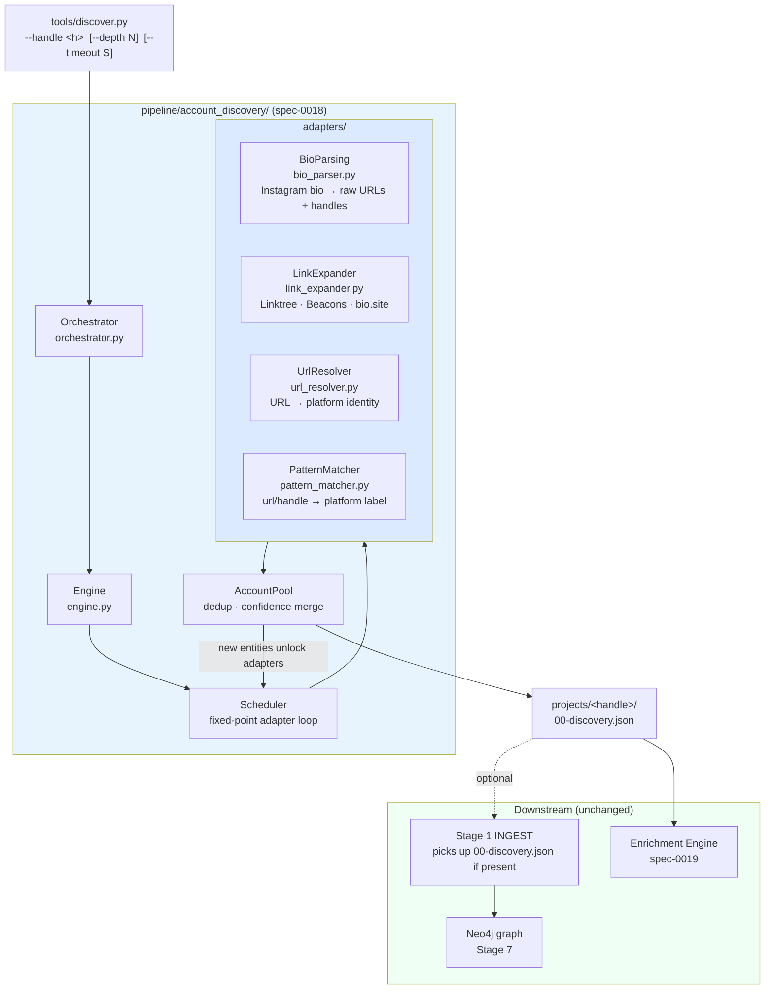
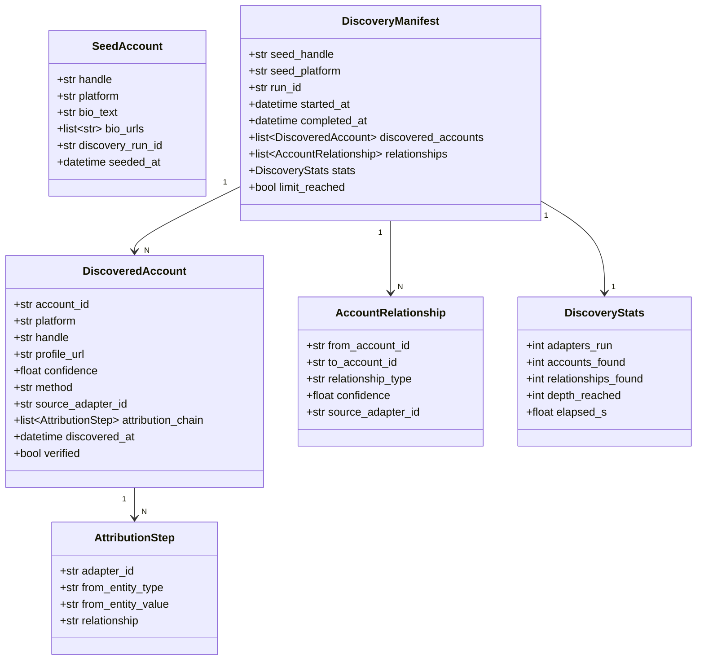
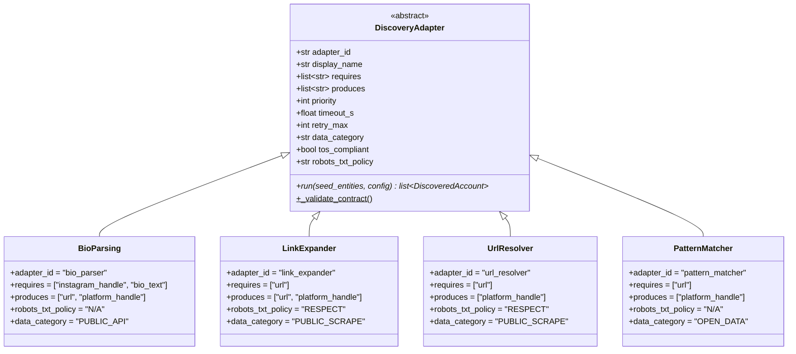
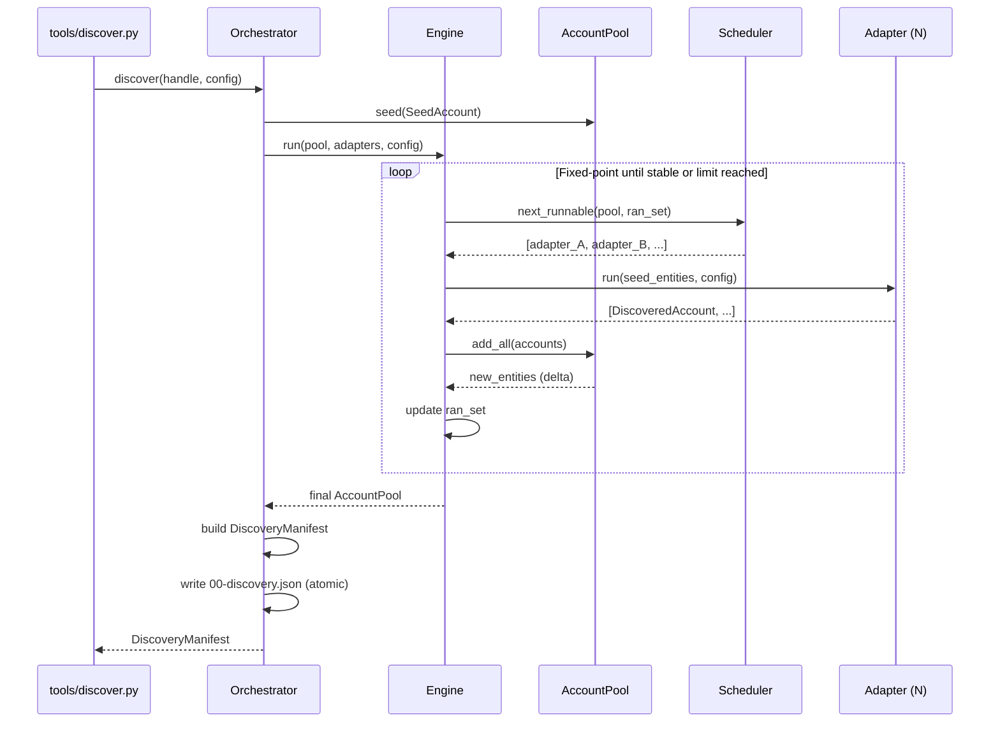

# Spec 0018 — Account Discovery Engine

**Status:** draft · **Date:** 2026-06-03 · **Method:** Spec-Driven Development

---

## 0. Philosophy (SDD)

This spec describes **what** and **why**, separated from **how**. Each section defines:

1. **Responsibility** — single concern this module owns.
2. **Inputs** — format and expected structure.
3. **Outputs** — format and structure produced.
4. **Contracts** — rules adapters must satisfy.
5. **Invariants** — rules the engine may never violate.
6. **Failure modes** — what counts as failure; what the module does NOT do.

The implementation lives in `pipeline/account_discovery/`; this spec is the source of truth.
No adapter or engine change is valid without a spec section that justifies it.

---

## 1. Problem

The current pipeline starts from a single Instagram handle and never asks: *does this creator
exist anywhere else?* A creator's bio typically references 3–8 other platforms; a Linktree page
expands to even more. Without systematic discovery, every downstream stage — enrichment, linkage,
dossier — operates on an artificially thin identity.

Concrete gaps:

- `linktr.ee/creator` in the bio → 6–12 platform links that are never resolved.
- An explicit YouTube or TikTok mention in the bio is never captured as a structured account.
- Platform handles that differ from the Instagram handle (e.g. `@brand_official` on Instagram
  but `@BrandOfficial` on YouTube) are never reconciled.
- Multiple bio links may point to the same logical account via different redirect chains.

The root cause is architectural: Stage 1 ingests a single profile with a single adapter and
performs no identity fan-out. There is no module responsible for the question
*"what accounts does this creator own?"*

---

## 2. Goals / Non-Goals

### Goals

- An **Account Discovery Engine** (`pipeline/account_discovery/engine.py`) that takes a seed
  account and returns a set of normalized `DiscoveredAccount` entities.
- An **adapter-driven model**: every discovery source is a `DiscoveryAdapter` that declares
  what it needs (`requires`) and what it produces (`produces`).
- A **fixed-point scheduling loop**: after each adapter run, newly discovered entities unlock
  further adapters; the engine iterates until no new accounts are found or limits are reached.
- A **`discovered_accounts.json`** output artifact that Stage 1 and the Enrichment Engine
  (spec 0019) can consume independently.
- Source attribution on every discovered account — which adapter found it, from which seed entity.

### Non-Goals

- Enriching discovered accounts (that is spec 0019's responsibility).
- Storing discovered accounts in Neo4j (that is Stage 7's responsibility).
- Scoring or ranking discovered accounts for campaign fit (that is Stage 6's responsibility).
- Running OSINT tools like Holehe or GHunt — those require email seeds, which belong to the
  enrichment layer.

---

## 3. System Position

Account Discovery is a **standalone tool** (`tools/discover.py`) that writes
`projects/<handle>/00-discovery.json`. It has no mandatory dependency on the main pipeline;
callers decide whether to chain it before Stage 1.



**Architecture Invariant:** Account Discovery never imports from `pipeline.enrichment`,
`pipeline.compliance`, `pipeline.graph`, or any stage module. Its only allowed dependencies
are `pipeline.account_discovery.*`, stdlib, and declared third-party libraries.

---

## 4. Data Model



### `00-discovery.json` shape

```json
{
  "seed_handle": "creator123",
  "seed_platform": "instagram",
  "run_id": "disc-abc123",
  "started_at": "2026-06-03T10:00:00Z",
  "completed_at": "2026-06-03T10:00:12Z",
  "discovered_accounts": [
    {
      "account_id": "acc-001",
      "platform": "youtube",
      "handle": "Creator123Official",
      "profile_url": "https://youtube.com/@Creator123Official",
      "confidence": 0.92,
      "method": "bio_link_expansion",
      "source_adapter_id": "link_expander",
      "attribution_chain": [
        {
          "adapter_id": "bio_parser",
          "from_entity_type": "instagram_handle",
          "from_entity_value": "creator123",
          "relationship": "bio_url"
        },
        {
          "adapter_id": "link_expander",
          "from_entity_type": "url",
          "from_entity_value": "linktr.ee/creator123",
          "relationship": "linktree_link"
        }
      ],
      "discovered_at": "2026-06-03T10:00:05Z",
      "verified": false
    }
  ],
  "relationships": [
    {
      "from_account_id": "seed",
      "to_account_id": "acc-001",
      "relationship_type": "same_creator",
      "confidence": 0.92,
      "source_adapter_id": "link_expander"
    }
  ],
  "stats": {
    "adapters_run": 3,
    "accounts_found": 4,
    "relationships_found": 4,
    "depth_reached": 2,
    "elapsed_s": 11.8
  },
  "limit_reached": false
}
```

---

## 5. Adapter Contract

Every discovery adapter is a subclass of `DiscoveryAdapter` (defined in `contracts.py`).
The contract is intentionally narrow — adapters discover accounts, nothing else.



**Contract invariants:**

- `adapter_id` is globally unique across all discovery adapters.
- `requires` and `produces` values are drawn from a closed vocabulary (`ENTITY_TYPES` in `contracts.py`).
- `tos_compliant = False` prevents the adapter from running unless `ALLOW_NONCOMPLIANT=true`.
- `robots_txt_policy ∈ {RESPECT, N/A}` — `RESPECT` means the engine checks robots.txt before
  fetching; `N/A` means the adapter makes no HTTP requests to target sites.
- `run()` returns a list of `DiscoveredAccount`; it never raises on partial failure — it returns
  an empty list and logs the error.

---

## 6. Engine Execution Flow



**Fixed-point rule:** An adapter is *runnable* when all its `requires` entity types are present
in the pool AND it has not already run for that exact `(adapter_id, entity_value)` tuple.
The loop terminates when `next_runnable()` returns an empty list, or when `max_depth` or
`max_adapters` limits are hit.

**Architecture Invariant:** Each `(adapter_id, entity_type, entity_value)` triple runs at most
once per discovery session. The scheduler enforces this via a `ran_set` — there is no
recursion or unbounded fan-out.

**Architecture Invariant:** `AccountPool.add()` deduplicates on `(platform, handle)`. When
the same account is discovered by two adapters, the higher-confidence entry wins and the
lower-confidence entry's attribution steps are appended to the winner's `attribution_chain`.

---

## 7. Module Structure

```text
pipeline/
└── account_discovery/
    ├── __init__.py          # public surface: discover(), DiscoveredAccount, DiscoveryManifest
    ├── orchestrator.py      # entry point; wires engine → manifest → atomic write
    ├── engine.py            # fixed-point scheduling loop
    ├── models.py            # DiscoveredAccount, AccountRelationship, DiscoveryManifest, DiscoveryStats
    ├── contracts.py         # DiscoveryAdapter ABC; ENTITY_TYPES; AdapterContractError
    ├── pool.py              # AccountPool: dedup, confidence merge, delta tracking
    ├── scheduler.py         # next_runnable(); dependency resolution
    ├── adapters/
    │   ├── __init__.py
    │   ├── bio_parser.py    # Instagram bio → URLs + explicit platform handles
    │   ├── link_expander.py # Linktree / Beacons / bio.site → platform links
    │   ├── url_resolver.py  # arbitrary URL → canonical platform identity
    │   └── pattern_matcher.py # URL/handle pattern → platform label + normalized handle
    └── tests/
        ├── __init__.py
        ├── conftest.py      # fixtures: seed accounts, fake adapters, pool snapshots
        ├── test_engine.py
        ├── test_pool.py
        ├── test_scheduler.py
        ├── test_contracts.py
        └── test_adapters/
            ├── test_bio_parser.py
            ├── test_link_expander.py
            ├── test_url_resolver.py
            └── test_pattern_matcher.py

tools/
└── discover.py              # CLI entry point: --handle, --depth, --timeout, --output-dir
```

---

## 8. Resource Limits

| Limit              | Default | Env var                 | Description                                  |
|--------------------|---------|-------------------------|----------------------------------------------|
| `max_depth`        | 2       | `DISCOVERY_MAX_DEPTH`   | Max adapter hops from seed                   |
| `max_adapters`     | 10      | `DISCOVERY_MAX_ADAPTERS`| Max total adapter runs per session           |
| `max_timeout_s`    | 30      | `DISCOVERY_TIMEOUT_S`   | Wall-clock budget for the full session       |
| `max_accounts`     | 50      | `DISCOVERY_MAX_ACCOUNTS`| Hard cap on `DiscoveredAccount` entries      |

When any limit is reached, the engine stops, sets `limit_reached: true` in the manifest, and
writes whatever has been found. It never raises.

---

## 9. Compliance Constraints

Account Discovery shares governance rules with spec-0020 (Compliance & Governance) but
enforces a subset inline via the adapter contract:

| Constraint            | Enforced by                              |
|-----------------------|------------------------------------------|
| `tos_compliant`       | Orchestrator rejects adapter if `false` (unless `ALLOW_NONCOMPLIANT=true`) |
| `robots_txt_policy`   | Engine calls governance checker before any adapter with `RESPECT` policy |
| `data_category`       | Logged into `00-discovery.json` provenance; feeds spec-0020 coverage metrics |
| Attribution chain     | Engine enforces non-empty `attribution_chain` on every `DiscoveredAccount` |

**Architecture Invariant:** No `DiscoveredAccount` enters the manifest without a non-empty
`attribution_chain`. An adapter that returns accounts without attribution raises
`DiscoveryContractError` at engine validation time.

---

## 10. Acceptance Criteria

| ID  | Criterion                                                                              | Tested in                              |
|-----|----------------------------------------------------------------------------------------|----------------------------------------|
| AC1 | Given a seed Instagram handle with a bio containing a Linktree URL, the engine returns ≥1 `DiscoveredAccount` with `platform ≠ instagram`. | `test_engine.py::test_bio_linktree_expansion` |
| AC2 | Every `DiscoveredAccount` in the manifest has a non-empty `attribution_chain`.         | `test_contracts.py::test_attribution_required` |
| AC3 | Discovery logic is adapter-driven: adding a new `DiscoveryAdapter` subclass is the only change required to support a new platform. | `test_contracts.py::test_new_adapter_pluggable` |
| AC4 | `tools/discover.py` can run without any pipeline stages having been run (no `01-raw.json` required). | `test_engine.py::test_standalone_execution` |
| AC5 | No enrichment-specific logic (`engine.py`, `entity_pool`, `AdapterConfig` from spec 0014) is imported in `pipeline/account_discovery/`. | `test_contracts.py::test_no_enrichment_import` |
| AC6 | When `max_depth` is reached, the manifest is written with `limit_reached: true` and no exception is raised. | `test_engine.py::test_depth_limit` |
| AC7 | The same `(platform, handle)` discovered by two adapters results in one `DiscoveredAccount` with a merged `attribution_chain`. | `test_pool.py::test_dedup_merge_attribution` |

---

## 11. Interface with Other Specs

| Spec | Direction | What crosses the boundary |
|------|-----------|--------------------------|
| Spec 0019 (Enrichment Engine) | → | `00-discovery.json` is read as the initial entity seed for the enrichment engine's `EntityPool`. |
| Spec 0020 (Compliance & Governance) | → | `robots_txt_policy` is checked using the shared `RobotsPolicy` checker from spec-0020. |
| Stage 1 INGEST | → | `00-discovery.json` is attached to `01-raw.json` under `_discovery` key (optional). |
| Stage 7 LOAD | ← | Discovered accounts are NOT written to Neo4j by this spec; Stage 7 handles graph persistence after enrichment. |

---

## 12. Decisions Register

| ID | Decision | Basis |
|----|----------|-------|
| D1 | Fixed-point scheduling loop (same pattern as spec 0014 enrichment engine) | Handles multi-hop discovery without explicit DAG wiring; Linktree → YouTube link unlocks `url_resolver` automatically |
| D2 | `(platform, handle)` dedup key, not URL | Handles redirect chains and canonical vs mobile URLs pointing to the same identity |
| D3 | `robots_txt_policy ∈ {RESPECT, N/A}` — no `DENY` option | Adapters that would need `DENY` (i.e. must violate robots.txt) are not permitted; they belong in an OSINT tool with explicit user consent |
| D4 | No OSINT (Holehe, GHunt) in this spec | OSINT requires email seeds which are discovered by enrichment, not by bio parsing; cross-spec separation keeps each spec independently testable offline |
| D5 | Output as `00-discovery.json` (pre-stage artifact, numbered below Stage 1) | Signals that discovery is optional pre-processing; Stage 1 can run without it; the numbering convention mirrors the existing `projects/<handle>/` artifact series |
