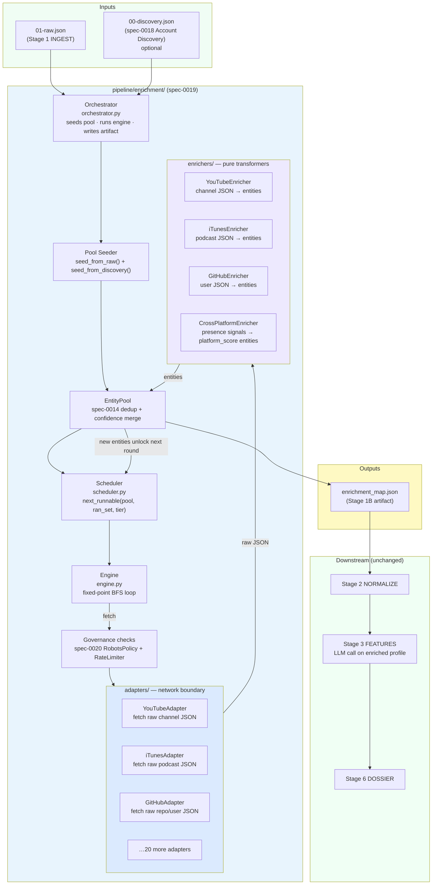
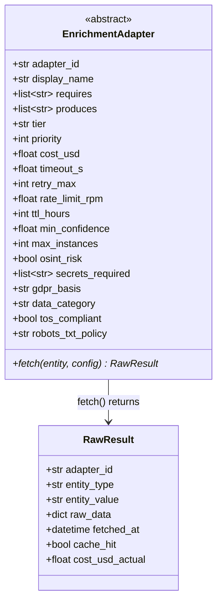
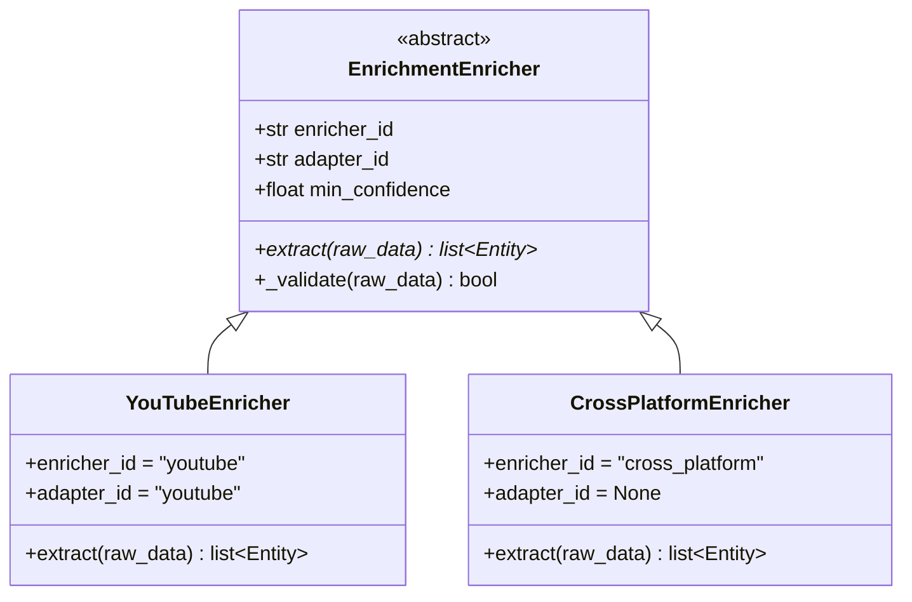
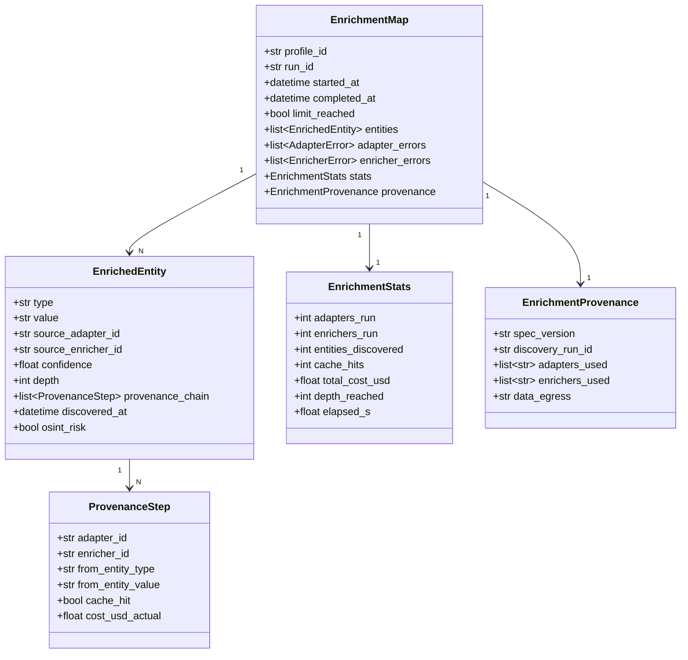

# Spec 0019 — Enrichment Engine

**Status:** draft · **Date:** 2026-06-03 · **Method:** Spec-Driven Development

---

## 0. Philosophy (SDD)

This spec describes **what** and **why**, separated from **how**. Each section defines:

1. **Responsibility** — single concern this module owns.
2. **Inputs** — format and expected structure.
3. **Outputs** — format and structure produced.
4. **Contracts** — rules adapters and enrichers must satisfy.
5. **Invariants** — rules the engine may never violate.
6. **Failure modes** — what counts as failure; what the module does NOT do.

The implementation lives in `pipeline/enrichment/`; this spec is the source of truth.
Spec 0014 established the foundational entity model and fixed-point scheduler; this spec
extends that foundation with a richer input contract (consumed accounts from spec-0018),
a new `enrichers/` layer (pure data transformers), and formal provenance tracking.

---

## 1. Problem

Spec 0014 established the enrichment engine and it works — but it treats the seed profile
as its only entry point. Two gaps have emerged since:

1. **No account-aware seeding.** The entity pool is seeded from the Instagram raw profile
   only. After Account Discovery (spec-0018), we know about the creator's YouTube channel,
   podcast, and GitHub account — but the enrichment engine ignores `00-discovery.json`.
   Every adapter that could enrich those accounts is skipped because the required
   entity types (`youtube_handle`, `github_handle`) were never seeded.

2. **Adapters do too much.** Each adapter currently fetches raw data AND extracts entities
   from it. This coupling makes adapters hard to test (need live HTTP), hard to evolve
   (extraction logic buried inside a network-boundary class), and impossible to run
   deterministically with fixture data. A YouTube adapter that changes its extraction
   logic requires an HTTP mock update even when the extraction logic is the only thing
   being tested.

The fix is two structural changes:
- Seed the entity pool from both `01-raw.json` and `00-discovery.json`.
- Introduce an `enrichers/` layer: adapters fetch raw data; enrichers transform it into
  entities. Both layers are independently testable.

---

## 2. Relationship to Spec 0014

Spec 0019 is **additive, not a replacement**. The following from spec 0014 are inherited
unchanged:

| Component | Inherited from spec 0014 | Extended here |
|-----------|--------------------------|---------------|
| `Entity` dataclass (type, value, source, confidence, depth) | ✓ | — |
| `EntityPool` dedup keyed on `(type, value)` | ✓ | Now also seeded from `00-discovery.json` |
| Fixed-point BFS scheduler (`is_runnable`) | ✓ | Now schedules enrichers too |
| Per-adapter TTL cache | ✓ | Cache key extended to include entity provenance hash |
| Resource limits (`max_depth`, `max_adapter_runs`, `max_cost_usd`) | ✓ | — |
| Three-tier execution model (seed / fast / medium+slow) | ✓ | — |
| Adapter governance fields (`tos_compliant`, `gdpr_basis`, `data_category`) | ✓ | `robots_txt_policy` enforcement delegated to spec-0020 |
| `enrichment_map.json` artifact | ✓ | Provenance block added (§8) |

Compliance enforcement (robots.txt, rate limiting, coverage metrics) is extracted from
inline adapter code and delegated to spec-0020 (Compliance & Governance). The adapter
contract retains the governance *declarations*; enforcement logic lives in spec-0020.

---

## 3. System Position



**Architecture Invariant:** The enrichment engine is the only consumer of `00-discovery.json`
in the core pipeline. Stage 1 attaches discovery data to `01-raw.json` as a metadata block;
the engine reads both and merges them into a single `EntityPool` before the first adapter runs.

---

## 4. Inputs

### 4.1 `01-raw.json` (required)

The existing Stage 1 output. The engine reads:

| Field path | Entity type seeded | Notes |
|---|---|---|
| `raw_profile.username` | `instagram_handle` (depth=0) | Always present |
| `raw_profile.bio_url` | `url` (depth=0) | If non-null |
| `raw_profile.email` | `email` (depth=0) | If present |
| `_discovery` | (see §4.2) | If Stage 1 attached discovery data |

### 4.2 `00-discovery.json` (optional)

Output of spec-0018. If present (either as a standalone file or as `01-raw.json._discovery`),
every `DiscoveredAccount` is translated into a seed entity:

| `DiscoveredAccount.platform` | Entity type seeded | Seed depth |
|---|---|---|
| `youtube` | `youtube_handle` | 1 |
| `github` | `github_handle` | 1 |
| `spotify` | `spotify_handle` | 1 |
| `itunes` | `itunes_artist_id` | 1 |
| `twitch` | `twitch_handle` | 1 |
| `reddit` | `reddit_handle` | 1 |
| `substack` | `substack_url` | 1 |
| `linkedin` | `linkedin_url` | 1 |
| `tiktok` | `tiktok_handle` | 1 |
| *(unknown)* | `url` | 1 |

**Architecture Invariant:** Discovery entities always seed at `depth=1` — they are one hop
from the Instagram seed. This means adapters that consume them run at `depth=1`, and their
produced entities are at `depth=2`. The `max_depth=2` default from spec-0014 therefore covers
the full discovery → enrichment → signal chain without change.

---

## 5. Adapter / Enricher Split

### 5.1 The two-layer model

```mermaid
flowchart LR
    subgraph ADAPTER["EnrichmentAdapter\n(network boundary)"]
        FETCH["fetch(entity) → RawResult\nHTTP call / subprocess / file read\nReturns opaque raw_data dict"]
    end

    subgraph ENRICHER["EnrichmentEnricher\n(pure transformer)"]
        EXTRACT["extract(raw_data) → list[Entity]\nNo I/O — pure function of raw_data\nRaises EnricherError on invalid data"]
    end

    ENTITY["Seed Entity\n(from EntityPool)"] --> ADAPTER
    ADAPTER -->|RawResult| ENRICHER
    ENRICHER -->|list[Entity]| POOL["EntityPool"]
    POOL --> ADAPTER

    style ADAPTER fill:#dbeafe
    style ENRICHER fill:#ede9fe
```

Every data source is implemented as an `(adapter, enricher)` pair. The engine calls:
1. `adapter.fetch(entity)` → `RawResult(raw_data, adapter_id, fetched_at, cache_hit)`
2. `enricher.extract(raw_result.raw_data)` → `list[Entity]`
3. Resulting entities are added to the pool.

### 5.2 Adapter contract (extends spec 0014)



**New field vs spec 0014:** `robots_txt_policy ∈ {RESPECT, N/A}`. Adapters that scrape target
sites declare `RESPECT`; adapters that call official APIs declare `N/A`. Enforcement is done
by spec-0020's `RobotsPolicy` checker before `fetch()` is called. Adapters do not check robots.txt
themselves.

**Changed method:** `run()` (spec 0014) is renamed `fetch()` and now returns `RawResult` instead
of `list[Entity]`. Entity extraction is the enricher's responsibility.

### 5.3 Enricher contract



**Enricher invariants:**
- `extract()` is a **pure function**: no network calls, no file I/O, no randomness.
- `extract()` never raises for partial data — missing fields return fewer entities, not exceptions.
- Each returned `Entity` carries `source = enricher.enricher_id` and a `confidence` derived
  from the raw data quality (not defaulted to 1.0).
- `CrossPlatformEnricher` is the only enricher with `adapter_id = None` — it operates on
  the full entity pool snapshot rather than a single adapter's raw output.

---

## 6. Engine Execution Flow

```mermaid
sequenceDiagram
    participant ORCH as Orchestrator
    participant SEED as Pool Seeder
    participant ENG as Engine
    participant SCH as Scheduler
    participant GOV as Governance (spec-0020)
    participant ADP as Adapter
    participant ENR as Enricher
    participant POOL as EntityPool

    ORCH->>SEED: seed_from_raw(01-raw.json)
    ORCH->>SEED: seed_from_discovery(00-discovery.json)
    SEED->>POOL: add seed entities (depth 0 + depth 1)
    ORCH->>ENG: run(pool, adapters, enrichers, config)

    loop Fixed-point until stable or limit reached
        ENG->>SCH: next_runnable(pool, ran_set, tier)
        SCH-->>ENG: [(adapter_A, entity_1), (adapter_B, entity_2), ...]
        par parallel within tier
            ENG->>GOV: check_robots(adapter_A, entity_1)
            GOV-->>ENG: allowed
            ENG->>GOV: check_rate_limit(adapter_A)
            GOV-->>ENG: allowed
            ENG->>ADP: fetch(entity_1, config)
            ADP-->>ENG: RawResult
            ENG->>ENR: extract(raw_result.raw_data)
            ENR-->>ENG: [Entity, Entity, ...]
            ENG->>POOL: add_all(entities)
        end
        POOL-->>ENG: new_entity_delta
        ENG->>ENG: update ran_set; check limits
    end

    ENG->>ENR: CrossPlatformEnricher.extract(pool.snapshot())
    ENR-->>ENG: [platform_score entities]
    ENG->>POOL: add_all(platform_score_entities)
    ENG-->>ORCH: final EntityPool

    ORCH->>ORCH: build_enrichment_map(pool)
    ORCH->>ORCH: write enrichment_map.json (atomic)
    ORCH-->>ORCH: done
```

**Architecture Invariant:** `CrossPlatformEnricher` always runs **after** the fixed-point loop
completes, not inside it. It synthesizes signals from the complete entity pool and is not eligible
for the BFS scheduler.

**Architecture Invariant:** Failed adapter `fetch()` calls are caught and logged to
`enrichment_map.adapter_errors[]`. They never interrupt the fixed-point loop. A failed enricher
`extract()` is also caught and logged — the raw data is discarded, not retried.

---

## 7. Output: `enrichment_map.json`



### Provenance invariant

**Architecture Invariant:** Every `EnrichedEntity` carries a non-empty `provenance_chain`.
An entity with an empty chain is rejected at manifest build time with
`EnrichmentProvenanceError`. This satisfies GDPR Art. 22 explainability for any entity
that reaches Stage 3 (features) or Stage 6 (dossier).

### Determinism invariant

**Architecture Invariant:** For identical inputs (`01-raw.json`, `00-discovery.json`) and
an empty TTL cache, the enrichment engine produces byte-identical `enrichment_map.json` on
repeated runs. This requires:
- Adapters sort their returned entities before returning `RawResult.raw_data`.
- `EntityPool` iteration order is deterministic (insertion order, Python 3.7+ dict guarantee).
- No random IDs — `run_id` is a hash of `(profile_id, started_at_truncated_to_minute)`.
- `CrossPlatformEnricher` is a pure function of the pool snapshot.

---

## 8. Module Structure

```text
pipeline/
└── enrichment/
    ├── __init__.py            # public surface: run_engine(), EnrichmentMap, EnrichedEntity
    ├── orchestrator.py        # entry point; seeds pool, calls engine, writes artifact
    ├── engine.py              # fixed-point BFS loop (extends spec-0014 engine.py)
    ├── scheduler.py           # next_runnable(); dependency + tier + limit resolution
    ├── models.py              # EnrichmentMap, EnrichedEntity, ProvenanceStep, EnrichmentStats
    ├── pool.py                # EntityPool (spec-0014); extended with snapshot() for enrichers
    ├── seeder.py              # seed_from_raw(), seed_from_discovery()   ← NEW
    │
    ├── adapters/              # network boundary: fetch raw data only
    │   ├── __init__.py
    │   ├── base.py            # EnrichmentAdapter ABC + RawResult
    │   ├── youtube.py
    │   ├── itunes.py
    │   ├── spotify.py
    │   ├── github.py
    │   ├── reddit.py
    │   ├── twitch.py
    │   ├── linktree.py
    │   ├── whois.py
    │   ├── crt.py
    │   ├── knowledge_graph.py
    │   ├── wikidata.py
    │   ├── cnpj.py
    │   ├── holehe.py
    │   ├── ghunt.py
    │   ├── hibp.py
    │   ├── gdelt.py
    │   ├── google_news.py
    │   ├── substack.py
    │   ├── maigret.py
    │   └── instagram_bio.py
    │
    ├── enrichers/             # pure transformers: extract entities from raw data  ← NEW
    │   ├── __init__.py
    │   ├── base.py            # EnrichmentEnricher ABC
    │   ├── youtube.py         # channel JSON → subscriber_count, view_count, topic entities
    │   ├── itunes.py          # podcast JSON → episode_count, category, rating entities
    │   ├── spotify.py         # artist JSON → follower_count, genre, popularity entities
    │   ├── github.py          # user JSON → repo_count, star_count, language entities
    │   ├── press.py           # GDELT/news JSON → press_mention, sentiment entities
    │   ├── business.py        # CNPJ/Wikidata JSON → legal_entity, founded_year entities
    │   └── cross_platform.py  # EntityPool snapshot → platform_score, reach entities
    │
    └── tests/
        ├── __init__.py
        ├── conftest.py
        ├── test_engine.py
        ├── test_scheduler.py
        ├── test_seeder.py
        ├── test_models.py
        ├── test_adapters/
        │   ├── test_youtube.py       # uses HTTP mocks; no live calls
        │   └── …
        └── test_enrichers/
            ├── test_youtube.py       # uses fixture JSON; no mocks needed
            ├── test_cross_platform.py
            └── …
```

---

## 9. Acceptance Criteria

| ID  | Criterion | Tested in |
|-----|-----------|-----------|
| AC1 | Every `DiscoveredAccount` in `00-discovery.json` is eligible for enrichment — the engine seeds corresponding entity types from the discovery manifest. | `test_seeder.py::test_discovery_accounts_seeded` |
| AC2 | Enrichment sources are independently pluggable — a new `(adapter, enricher)` pair is registered without modifying the engine or scheduler. | `test_engine.py::test_new_adapter_pluggable` |
| AC3 | Every `EnrichedEntity` in `enrichment_map.json` has a non-empty `provenance_chain`. | `test_models.py::test_provenance_required` |
| AC4 | A failed adapter `fetch()` (timeout, HTTP error) does not stop the fixed-point loop — other adapters continue and the error is recorded in `adapter_errors[]`. | `test_engine.py::test_adapter_failure_continues` |
| AC5 | For identical inputs and empty cache, two runs produce byte-identical `enrichment_map.json`. | `test_engine.py::test_deterministic_output` |
| AC6 | `enrichers/` tests pass without any HTTP mocking — all enricher tests use fixture JSON. | `tests/enrichers/conftest.py` (verified by no `responses`/`httpx` import) |
| AC7 | `CrossPlatformEnricher` runs exactly once, after the fixed-point loop, and its entities appear in the final manifest. | `test_engine.py::test_cross_platform_runs_post_loop` |
| AC8 | When `00-discovery.json` is absent, the engine seeds from `01-raw.json` only and produces a valid (smaller) `enrichment_map.json`. | `test_seeder.py::test_no_discovery_graceful` |

---

## 10. Interface with Other Specs

| Spec | Direction | What crosses the boundary |
|------|-----------|--------------------------|
| Spec-0018 (Account Discovery) | → | `00-discovery.json` seeds the entity pool via `seeder.seed_from_discovery()` |
| Spec-0020 (Compliance & Governance) | → | `RobotsPolicy.check()` and `RateLimiter.acquire()` are called before every `adapter.fetch()` |
| Stage 1 INGEST | → | `01-raw.json` is the required primary input |
| Stage 2 NORMALIZE | ← | `enrichment_map.json` is read by Stage 2 to augment the canonical `Profile` |
| Stage 3 FEATURES | ← | LLM prompt payload builder reads enriched entities from the profile |
| Stage 7 LOAD | ← | `enrichment_map.json` entities are written to Neo4j by Stage 7 (not by this spec) |

---

## 11. Decisions Register

| ID | Decision | Basis |
|----|----------|-------|
| D1 | Adapter/enricher split: `fetch()` returns `RawResult`, `extract()` returns `list[Entity]` | Separates network boundary from extraction logic; enricher tests need no HTTP mocking |
| D2 | `CrossPlatformEnricher` runs post-loop, not inside BFS | It synthesizes signals across all discovered entities; running it mid-loop would require re-triggering adapters |
| D3 | Discovery entities seed at `depth=1` | Preserves spec-0014's `max_depth=2` default without change; full discovery → enrichment → signal chain fits in 2 hops |
| D4 | Compliance enforcement delegated to spec-0020 | Keeps the engine's fixed-point loop free of policy logic; policy changes don't require engine changes |
| D5 | Determinism via sorted adapter output and minute-truncated run_id | Enables regression testing of `enrichment_map.json` without timestamp noise |
| D6 | Enrichment errors append to `enricher_errors[]`, never raise | Partial enrichment is more useful than a crash; callers inspect errors via the manifest |
