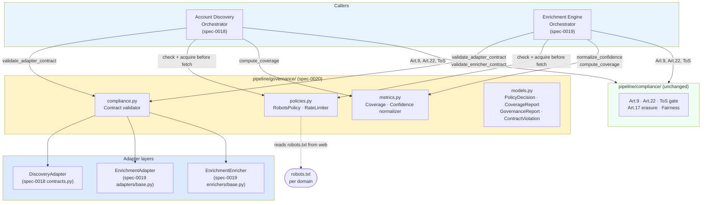
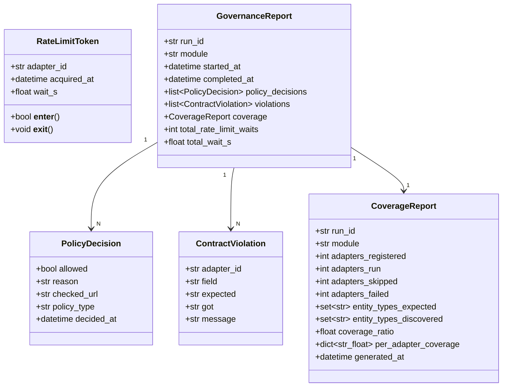
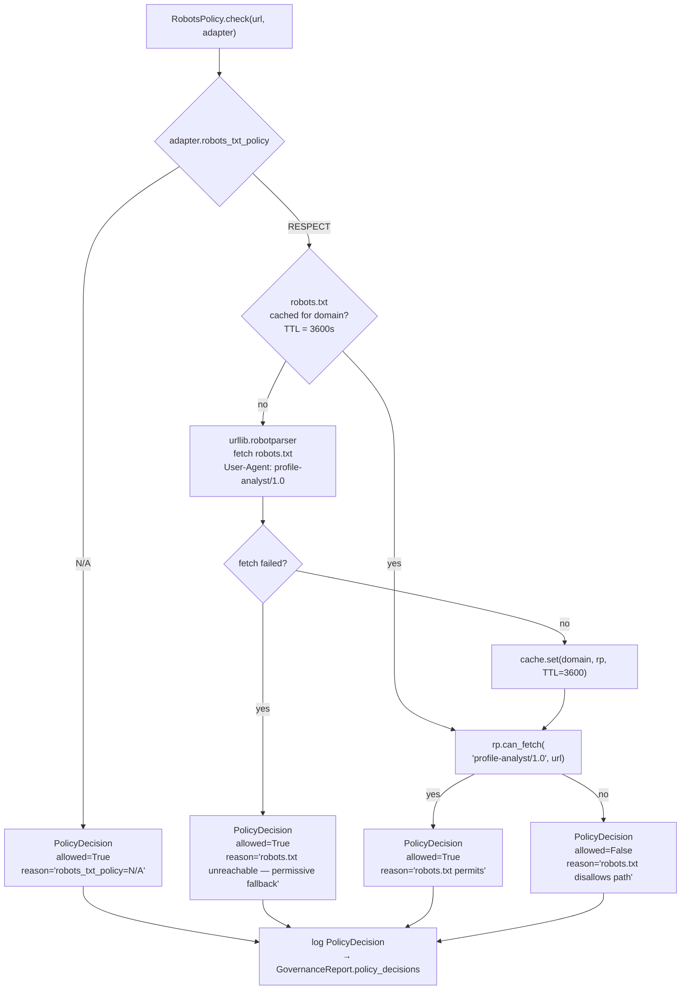
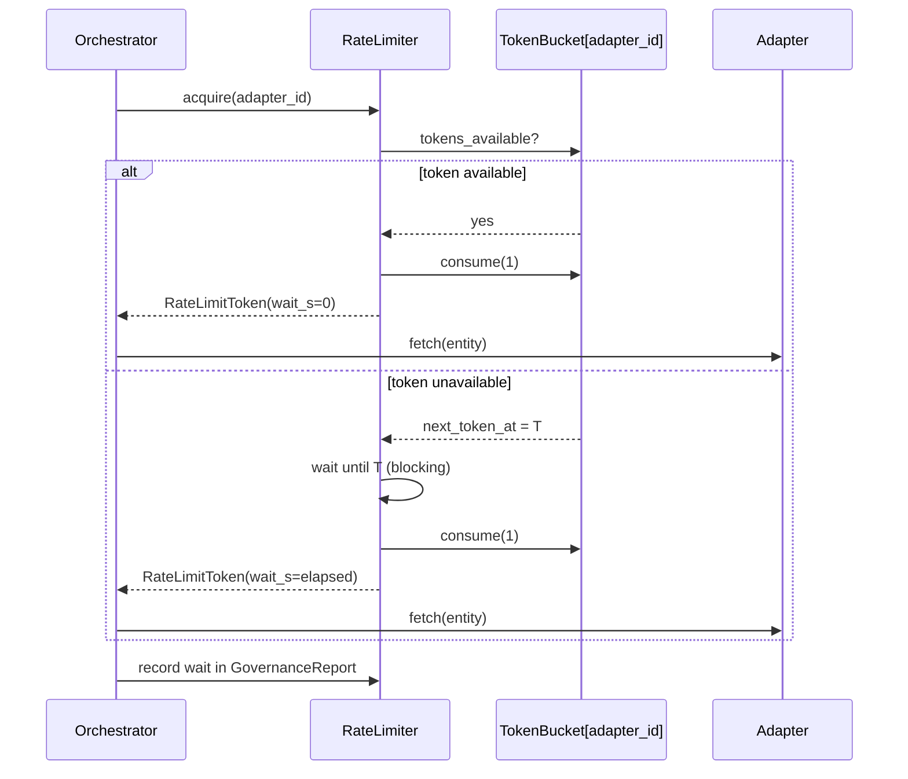
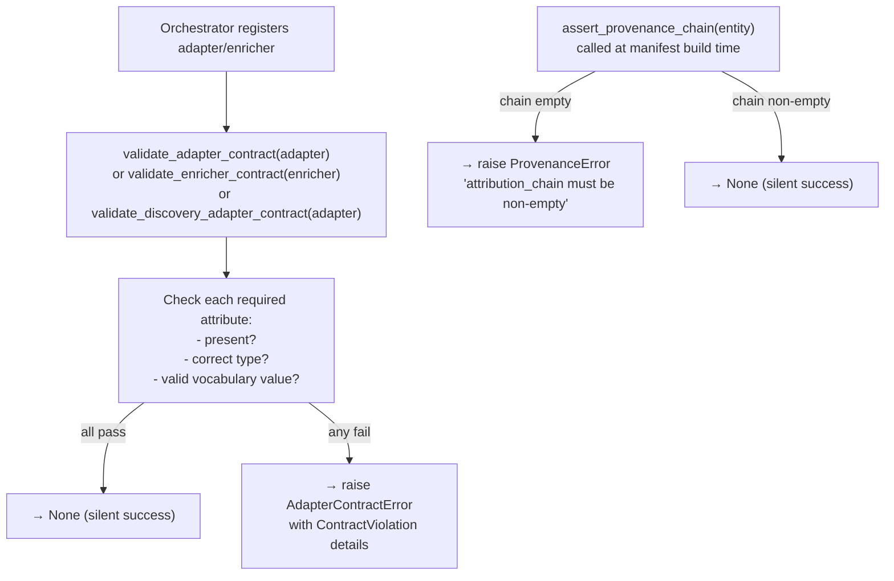
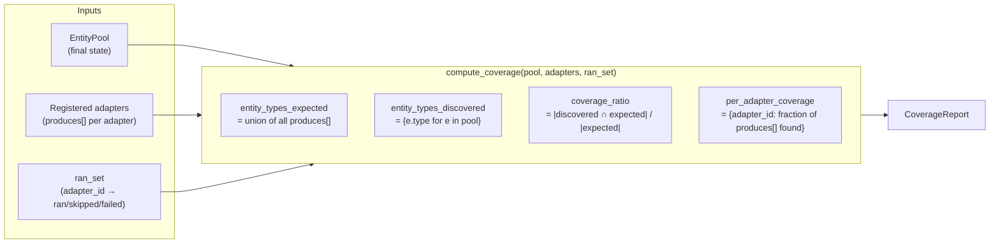
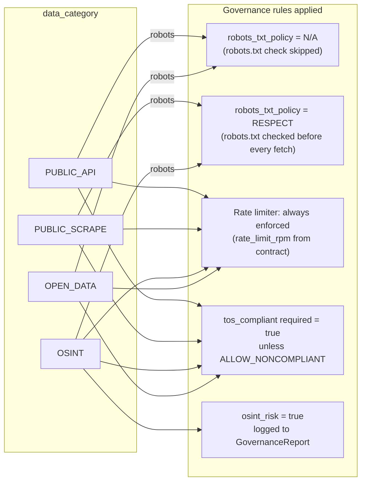

# Spec 0020 — Compliance & Governance

**Status:** draft · **Date:** 2026-06-03 · **Method:** Spec-Driven Development

---

## 0. Philosophy (SDD)

This spec describes **what** and **why**, separated from **how**. Each section defines:

1. **Responsibility** — single concern this module owns.
2. **Inputs** — what it receives at runtime.
3. **Outputs** — what it produces.
4. **Contracts** — rules callers must satisfy.
5. **Invariants** — rules this module may never violate.
6. **Failure modes** — what counts as failure; what the module does NOT do.

The implementation lives in `pipeline/governance/`; this spec is the source of truth.
No governance rule change is valid without a spec section that justifies it.

---

## 1. Problem

Governance logic is currently scattered across three places:

| Location | What it does | Problem |
|---|---|---|
| `pipeline/enrichment/adapter.py` | `_REQUIRED_ATTRS` contract validation | Not reusable — discovery adapters (spec-0018) have no equivalent |
| `pipeline/enrichment/engine.py` | Confidence clamping, inline rate-limit comments | Embedded in scheduler; cannot be tested independently |
| `docs/plans/2026-06-03-compliance-quality-refactor.md` | Planned robots.txt + rate limiter for enrichment only | Intended to rename `pipeline/enrichment/` to `pipeline/compliance_quality/` — mixes adapter governance with data fetching |

The result is that governance rules are:
- **Non-reusable:** the Discovery Engine (spec-0018) has no access to them.
- **Non-testable:** robots.txt logic embedded in the engine cannot be unit-tested in isolation.
- **Non-auditable:** no per-run `GovernanceReport` exists; governance decisions leave no record.

The fix is a standalone `pipeline/governance/` module that both spec-0018 (Account Discovery)
and spec-0019 (Enrichment Engine) call as a dependency — not a peer module or a stage.

---

## 2. Boundary with `pipeline/compliance/`

These two modules are **distinct and non-overlapping**:

| Module | Concern | Operates on | Owner spec |
|---|---|---|---|
| `pipeline/compliance/` | GDPR/FTC artifact compliance | Stage artifacts (`01-raw.json`, `03-features.json`, `06-dossier.json`) | spec-0001 §9 |
| `pipeline/governance/` | Adapter runtime governance | Adapter/enricher execution at fetch time | **this spec** |

`pipeline/governance/` never imports from `pipeline/compliance/`.
`pipeline/compliance/` never imports from `pipeline/governance/`.
Both are imported by the orchestrators of spec-0018 and spec-0019.

---

## 3. System Position



**Architecture Invariant:** `pipeline/governance/` is a leaf module — it imports from stdlib only.
It has no imports from `pipeline.enrichment`, `pipeline.account_discovery`,
`pipeline.compliance`, `pipeline.graph`, or any stage module.

---

## 4. Data Model



---

## 5. `policies.py` — RobotsPolicy and RateLimiter

### 5.1 RobotsPolicy



**Invariants:**
- `RobotsPolicy` never raises — it returns a `PolicyDecision` even on fetch failure.
- A `denied` decision does not trigger an exception in `RobotsPolicy` itself.
  The **orchestrator** decides whether to skip the adapter or abort the run.
  (Default: skip and record the denial in `GovernanceReport.policy_decisions`.)
- Robots.txt cache is in-process and per-session. It is not persisted to disk.
- The user-agent string is `profile-analyst/1.0` — fixed, not configurable.

### 5.2 RateLimiter



**Token bucket parameters:**

| Parameter | Source | Notes |
|---|---|---|
| `rate_limit_rpm` | `adapter.rate_limit_rpm` | Refill rate — tokens per minute |
| bucket capacity | `max(1, rate_limit_rpm // 10)` | Burst capacity — avoids hammering at startup |
| wait ceiling | `adapter.timeout_s` | If next token is further away than the adapter timeout, raise `RateLimitExceeded` immediately |

**Invariants:**
- `RateLimiter` is thread-safe (`threading.Lock` per bucket).
- One `RateLimiter` instance is shared across all adapter calls in a single run.
- `rate_limit_rpm = 0` means no rate limit — `acquire()` returns immediately.
- `RateLimitExceeded` is raised only when the wait would exceed `adapter.timeout_s`.
  The orchestrator records it in `adapter_errors[]`, not in `GovernanceReport.violations`.

---

## 6. `compliance.py` — Contract Validation

Validates that an adapter or enricher satisfies its declared contract **at registration time**
(before any fetch or extract call). This is the single place where `_REQUIRED_ATTRS` rules live.



### Required attributes by adapter type

| Attribute | Discovery Adapter | Enrichment Adapter | Enricher |
|---|---|---|---|
| `adapter_id` / `enricher_id` | ✓ | ✓ | ✓ |
| `display_name` | ✓ | ✓ | — |
| `requires` | ✓ | ✓ | — |
| `produces` | ✓ | ✓ | — |
| `data_category ∈ {PUBLIC_API, PUBLIC_SCRAPE, OSINT, OPEN_DATA}` | ✓ | ✓ | — |
| `tos_compliant: bool` | ✓ | ✓ | — |
| `robots_txt_policy ∈ {RESPECT, N/A}` | ✓ | ✓ | — |
| `gdpr_basis ∈ {LEGITIMATE_INTERESTS, CONSENT, NONE}` | — | ✓ | — |
| `osint_risk: bool` | — | ✓ | — |
| `tier ∈ {seed, fast, medium, slow}` | — | ✓ | — |
| `rate_limit_rpm: int ≥ 0` | — | ✓ | — |
| `timeout_s: float > 0` | — | ✓ | — |
| `min_confidence: float ∈ [0, 1]` | — | — | ✓ |
| `adapter_id` (links to parent adapter) | — | — | ✓ |

**Invariant:** `validate_*_contract()` is called once at registration, not at every fetch.
Runtime changes to adapter class attributes are not re-validated (adapters are treated as frozen
after registration).

**Invariant:** `validate_discovery_adapter_contract()` and `validate_adapter_contract()` share
the same validation engine — they call `_validate_attrs(obj, required_attrs)` with different
attribute sets. There is no duplicated validation logic.

---

## 7. `metrics.py` — Coverage and Confidence

### 7.1 Confidence normalization

```python
def normalize_confidence(value: float, *, warn_if_clamped: bool = True) -> float:
    """Clamp to [0.0, 1.0]. Logs a warning if clamping was needed."""
```

- Called by enricher orchestration after every `extract()` call.
- `warn_if_clamped=True` emits a `WARNING` log naming the enricher and the out-of-range value.
- Never raises — out-of-range values are always clamped.

### 7.2 Coverage metrics



**Coverage invariants:**
- `compute_coverage()` is pure — it reads the pool snapshot and registered adapters; it does
  not modify either.
- `coverage_ratio = 1.0` when no adapters were registered (vacuously complete).
- `per_adapter_coverage[adapter_id] = 0.0` when the adapter ran but produced no entities.
- `per_adapter_coverage[adapter_id]` is absent when the adapter was skipped (no matching
  `requires[]` in pool).
- The `CoverageReport` is always emitted — even on limit-reached or failed runs.

---

## 8. `GovernanceReport` emission

The orchestrators of spec-0018 and spec-0019 call `governance.build_report(run_id, module)`
at the start of a run. The `GovernanceReport` object is passed into `RobotsPolicy` and
`RateLimiter` for mutation (they append to `policy_decisions` and accumulate wait times).
At run end, the orchestrator serializes it into the output manifest:

- In `00-discovery.json`: under `governance` key.
- In `enrichment_map.json`: under `governance` key.

This means every output artifact carries a full audit trail of every governance decision made
during the run.

**Architecture Invariant:** The `GovernanceReport` is always written, including on runs that
hit resource limits, robot denials, or contract violations. An empty or partial run is still
auditable.

---

## 9. Module Structure

```text
pipeline/
└── governance/
    ├── __init__.py        # public surface: validate_adapter_contract, validate_enricher_contract,
    │                      # validate_discovery_adapter_contract, RobotsPolicy, RateLimiter,
    │                      # normalize_confidence, compute_coverage, build_report
    ├── policies.py        # RobotsPolicy (urllib.robotparser + TTL cache)
    │                      # RateLimiter (token-bucket, threading.Lock)
    ├── compliance.py      # validate_adapter_contract(), validate_enricher_contract(),
    │                      # validate_discovery_adapter_contract(), assert_provenance_chain()
    │                      # AdapterContractError, ProvenanceError, ContractViolation
    ├── metrics.py         # normalize_confidence(), compute_coverage(), CoverageReport
    ├── models.py          # PolicyDecision, RateLimitToken, GovernanceReport, ContractViolation
    └── tests/
        ├── __init__.py
        ├── conftest.py    # fake adapters with valid/invalid contracts; fake EntityPool
        ├── test_robots_policy.py     # uses responses or httpretty to mock robots.txt fetches
        ├── test_rate_limiter.py      # time.monotonic monkeypatched; no real sleeps
        ├── test_compliance.py        # contract validation for all three adapter types
        ├── test_metrics.py           # coverage ratio arithmetic; confidence clamping
        └── test_models.py            # GovernanceReport serialization roundtrip
```

---

## 10. Governance rules by data category



---

## 11. Acceptance Criteria

| ID  | Criterion | Tested in |
|-----|-----------|-----------|
| AC1 | Every adapter (Discovery + Enrichment) that omits a required governance field raises `AdapterContractError` at registration time, before any fetch runs. | `test_compliance.py::test_missing_field_raises` |
| AC2 | Every `EnrichedEntity` / `DiscoveredAccount` emitted without a provenance chain raises `ProvenanceError` at manifest build time. | `test_compliance.py::test_empty_provenance_raises` |
| AC3 | `RateLimiter.acquire()` enforces `rate_limit_rpm` — a second call within `60/rpm` seconds blocks until the next token is available. | `test_rate_limiter.py::test_token_bucket_blocks` |
| AC4 | `RobotsPolicy.check()` returns `allowed=False` for a URL disallowed by the domain's `robots.txt`. | `test_robots_policy.py::test_disallowed_path` |
| AC5 | `RobotsPolicy.check()` returns `allowed=True` with reason `'robots_txt_policy=N/A'` for an adapter with `data_category = PUBLIC_API`. | `test_robots_policy.py::test_na_policy_skips_check` |
| AC6 | `confidence` values outside `[0.0, 1.0]` are clamped and a WARNING log is emitted. | `test_metrics.py::test_confidence_clamp_warns` |
| AC7 | `compute_coverage()` emits a `CoverageReport` even when zero adapters ran. | `test_metrics.py::test_empty_run_coverage` |
| AC8 | `GovernanceReport` is present in `00-discovery.json` and `enrichment_map.json` output artifacts — including partial/limit-reached runs. | Integration tests in spec-0018 and spec-0019 test suites |
| AC9 | Governance rules are reusable: the same `validate_adapter_contract()` call works for both `DiscoveryAdapter` and `EnrichmentAdapter` instances without modification. | `test_compliance.py::test_cross_module_validation` |
| AC10 | `pipeline/governance/` has zero imports from `pipeline.compliance`, `pipeline.enrichment`, `pipeline.account_discovery`, or any stage module. | `test_compliance.py::test_no_cross_imports` (AST check) |

---

## 12. Interface with Other Specs

| Spec | Direction | What crosses the boundary |
|------|-----------|--------------------------|
| Spec-0018 (Account Discovery) | ← | Calls `validate_discovery_adapter_contract()`, `RobotsPolicy.check()`, `compute_coverage()` |
| Spec-0019 (Enrichment Engine) | ← | Calls `validate_adapter_contract()`, `validate_enricher_contract()`, `RobotsPolicy.check()`, `RateLimiter.acquire()`, `normalize_confidence()`, `compute_coverage()` |
| Spec-0001 §9 / `pipeline/compliance/` | (none) | Separate concerns; no shared imports in either direction |
| `docs/plans/2026-06-03-compliance-quality-refactor.md` | supersedes | The robots.txt + rate-limit + coverage work planned for `pipeline/enrichment/` is implemented here instead, as a standalone module |

---

## 13. Decisions Register

| ID | Decision | Basis |
|----|----------|-------|
| D1 | Standalone `pipeline/governance/` module, not embedded in enrichment or discovery | Makes rules reusable across both specs; keeps each module independently testable |
| D2 | `RobotsPolicy` returns a `PolicyDecision` rather than raising on denial | Orchestrators choose the consequence (skip vs abort); governance stays policy-free about caller behavior |
| D3 | Robots.txt cached in-process only, not persisted | Persistence adds infrastructure; in-process TTL is sufficient for a single run; a new process always gets fresh data |
| D4 | Token-bucket RateLimiter rather than sleep-between-calls | Token bucket handles burst correctly without starving adapters that have been idle |
| D5 | `validate_*_contract()` runs at registration, not at every fetch | Contracts are static class attributes; validating per-fetch would add latency with no benefit |
| D6 | `GovernanceReport` embedded in output artifacts under `governance` key | Audit trail lives with the data; no separate audit log file to manage or rotate |
| D7 | `pipeline/governance/` has zero imports from other pipeline subpackages | Prevents circular imports; makes the module trivially extractable or shared across projects |
